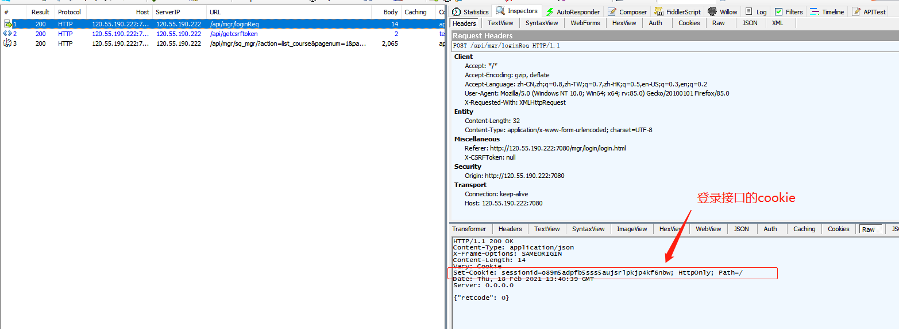
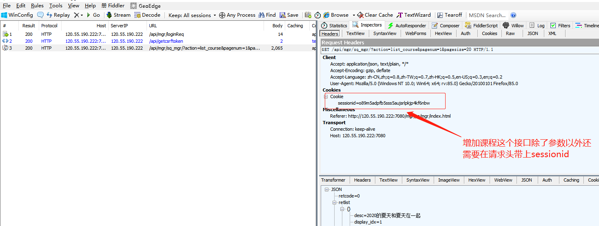
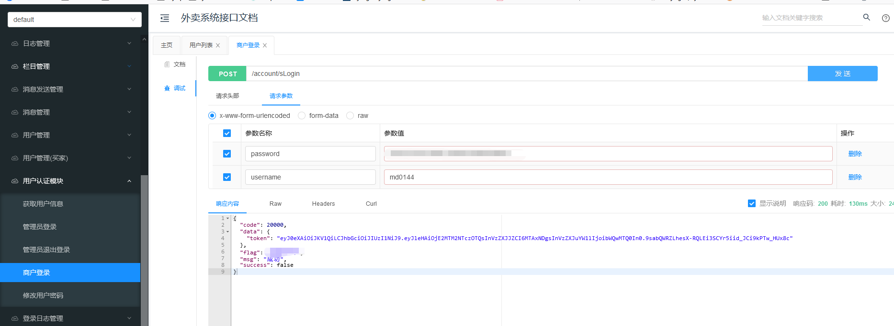

### cookie的使用场景

    根据上一节分析，得出以下使用方式
    
```python
# coding=utf-8
# @File     : cookie_test.py
# @Time     : 2021/2/18 19:35
# @Author   : jingan
# @Email    : 3028480064@qq.com
# @Software : PyCharm

import requests


def login(in_data):
    url = 'http://120.55.190.222:7080/api/mgr/loginReq'
    payload = in_data
    resp = requests.post(url=url, data=payload)
    print(resp.text)
    # 返回原生态cookie值，和只返回cookie中的sessionid值，注意下标顺序
    return resp.cookies,resp.cookies['sessionid']


if __name__ == '__main__':
    # 方案一
    # 原生态cookie下标为0
    cookie1 = login({'username': 'auto', 'password': 'sdfsdfsdf'})[0]
    # 其他接口请求可以直接将值传给cookies参数使用
    resp1 = requests.post('路径', cookies=cookie1)

    # 方案二
    session = login({'username': 'auto', 'password': 'sdfsdfsdf'})[1]
    # 这里除了获取sessionid值，需要二次封装可以加入其他值，例如token
    user_cookie = {'sessionid': session, 'token': 'dfasdfa'}
    resp2 = requests.post('路径', cookies=user_cookie)

```

### cookie实战练习
    根据上一节提供的接口
    以及下面的课程接口
    请求语法
    
> GET /api/mgr/sq_mgr/?action=list_course&pagenum=1&pagesize=20 HTTP/1.1

    url请求参数
    
|参数名|描述|
|-----|---|
|action|填写list_course，表明是要列出所有课程信息|
|pagenum|表示当前要显示的是第几页，目前固定填写1|
|pagesize|表示一页最多显示多少条课程信息,目前固定填写20|

    请求体内容:该请求无需指定请求内容
    
    响应内容
        * retcode值为0表示查询成功
        * total 值表示总共有多少门课程信息
        * retlist的内容是一个数组，其中每个元素对应一门课程信息，示例如下
        
```python
testData2 = {"action":"list_course", "pagenum":1,"pagesize":20}
```
        
    如果请求成功，返回json格式的消息体，如下所示
   
```python
{ 
    "retlist": [ 
        { 
            "desc": "初中语文", 
            "id": 418, 
            "display_idx": 1, 
            "name": "初中语文" 
        } 
    ],
    "total": 3, 
    "retcode": 0 
}
```





```python
# coding=utf-8
# @File     : cookie_test.py
# @Time     : 2021/2/18 19:35
# @Author   : jingan
# @Email    : 3028480064@qq.com
# @Software : PyCharm

import pprint
import requests


HOST = 'http://120.55.190.222:7080'
def login(in_data):
    url = f'{HOST}/api/mgr/loginReq'
    payload = in_data
    resp = requests.post(url=url, data=payload)
    return resp.cookies  # 返回原生态cookie

# 需要关联的接口
def add_lesson(user_cookie):
    url = f'{HOST}/api/mgr/sq_mgr/'
    in_data = {"action":"list_course", "pagenum":1,"pagesize":20}
    payload = in_data
    resp = requests.get(url=url, params=payload, cookies=user_cookie)
    pprint.pprint(resp.json())


if __name__ == '__main__':
    user_cookie = login({'username': 'auto', 'password': 'sdfsdfsdf'})
    add_lesson(user_cookie)

# 响应结果
"""
{'retcode': 0,
 'retlist': [{'desc': '2020的夏天和夏天在一起',
              'display_idx': 1,
              'id': 2735,
              'name': '夏天2020001'},
             {'desc': '11', 'display_idx': 1, 'id': 2808, 'name': '11'},
             {'desc': '初中化学课程', 'display_idx': 4, 'id': 2772, 'name': '初中化学'},
             {'desc': '机构类型', 'display_idx': 4, 'id': 2798, 'name': '机构类型化学'},
             {'desc': '初中化学课程', 'display_idx': 4, 'id': 2799, 'name': '机构期限'},
             {'desc': '初中化学1课程', 'display_idx': 4, 'id': 2800, 'name': '初中1化学'},
             {'desc': '大学英语课程', 'display_idx': 4, 'id': 2801, 'name': '大学英语'},
             {'desc': '初中化学课程', 'display_idx': 4, 'id': 2804, 'name': '初中化学1'},
             {'desc': '初中化学课程',
              'display_idx': 4,
              'id': 2805,
              'name': '初中化学111'},
             {'desc': '初中化学', 'display_idx': 5, 'id': 2789, 'name': '化学'},
             {'desc': '初中化学5课程', 'display_idx': 5, 'id': 2803, 'name': '初中5化学'},
             {'desc': '初中化学8课程', 'display_idx': 8, 'id': 2802, 'name': '初中8化学'},
             {'desc': '语文课，金老师', 'display_idx': 9, 'id': 2787, 'name': '语文'},
             {'desc': '高三生物', 'display_idx': 20, 'id': 2795, 'name': '生物'},
             {'desc': '高三英语系列课程',
              'display_idx': 21,
              'id': 2796,
              'name': '高三英语'},
             {'desc': '高三英语系列课程',
              'display_idx': 22,
              'id': 2797,
              'name': '高三英语1'},
             {'desc': '初物理课程', 'display_idx': 50, 'id': 2806, 'name': '初中物理'},
             {'desc': '初物理课程1',
              'display_idx': 50,
              'id': 2807,
              'name': '初中物理1'}],
 'total': 18}
"""
```
    

### https和http协议请求不同之处

    以下为http协议示例，注意url是带上端口号的
    
```python
# coding=utf-8
# @File     : cookie_test.py
# @Time     : 2021/2/18 19:35
# @Author   : jingan
# @Email    : 3028480064@qq.com
# @Software : PyCharm

import requests


def login(in_data):
    # http协议中url存在端口号
    url = 'http://120.55.190.222:7080/api/mgr/loginReq'
    payload = in_data
    resp = requests.post(url=url, data=payload)
    print(resp.text)

if __name__ == '__main__':
    login({'username': 'auto', 'password': 'sdfsdfsdf'})
```

    以下为https协议示例
    requests库是urllib开发库衍生的，因为urllib3对https协议是有严格限制的，直接访问会报错
    需要加上参数跳过验证verify=False

```python
# coding=utf-8
# @File     : cookie_test.py
# @Time     : 2021/2/18 19:35
# @Author   : jingan
# @Email    : 3028480064@qq.com
# @Software : PyCharm

import requests


def login(in_data):
    # https协议中url不存在端口号，将http换成https，添加verify参数
    url = 'https://120.55.190.222/api/mgr/loginReq'
    payload = in_data
    resp = requests.post(url=url, data=payload, verify=False)
    print(resp.text)

if __name__ == '__main__':
    login({'username': 'auto', 'password': 'sdfsdfsdf'})
```    

    上面代码是可以正确访问的，但存在一个警告：InsecureRequestWarning
    添加一行代码即可：requests.packages.urllib3.disable_warnings()
    
```python
# coding=utf-8
# @File     : cookie_test.py
# @Time     : 2021/2/18 19:35
# @Author   : jingan
# @Email    : 3028480064@qq.com
# @Software : PyCharm

import requests
requests.packages.urllib3.disable_warnings()  # 忽略警告

def login(in_data):
    # https协议中url不存在端口号，将http换成https，添加verify参数
    url = 'https://120.55.190.222/api/mgr/loginReq'
    payload = in_data
    resp = requests.post(url=url, data=payload, verify=False)
    print(resp.text)

if __name__ == '__main__':
    login({'username': 'auto', 'password': 'sdfsdfsdf'})
```

    注意：
        * 字典转化成json：json.dumps()
        * json转化成字典：json.loads()
        
        
### Swagger接口框架

    是一个规范完整的框架，用于生产、描述、调用和可视化RESTful风格的Web服务，总体目标是使客户端和
    文件系统作为服务器以同样的速度来更新，文件的方法，参数和模型紧密集成到服务器端的代码，允许API来始终保持同步
    
    作用：
        * 接口文档在线自动生成
        * 功能测试
        
    外卖系统接口文档：http://121.41.14.39:8082/doc.html
    

