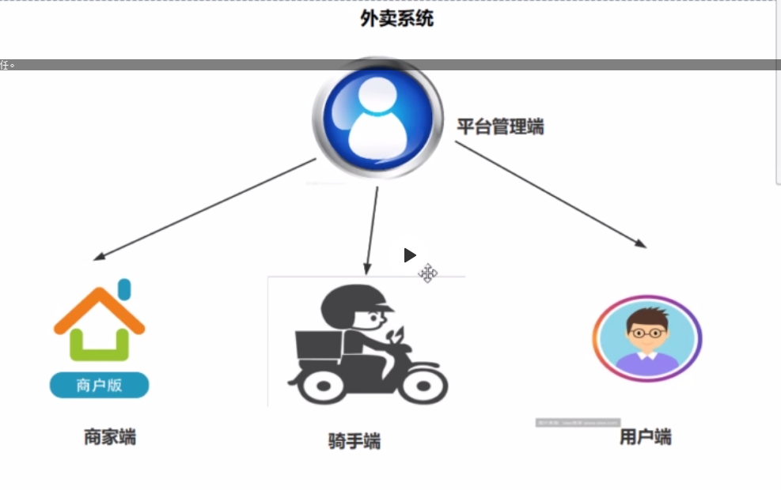
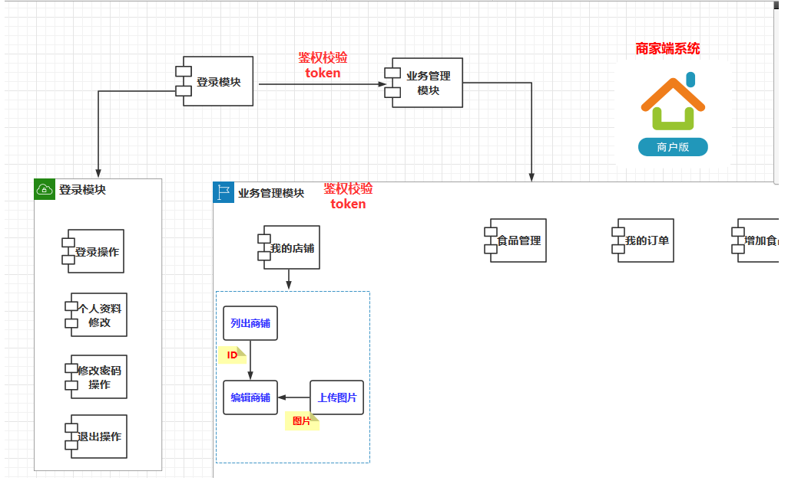
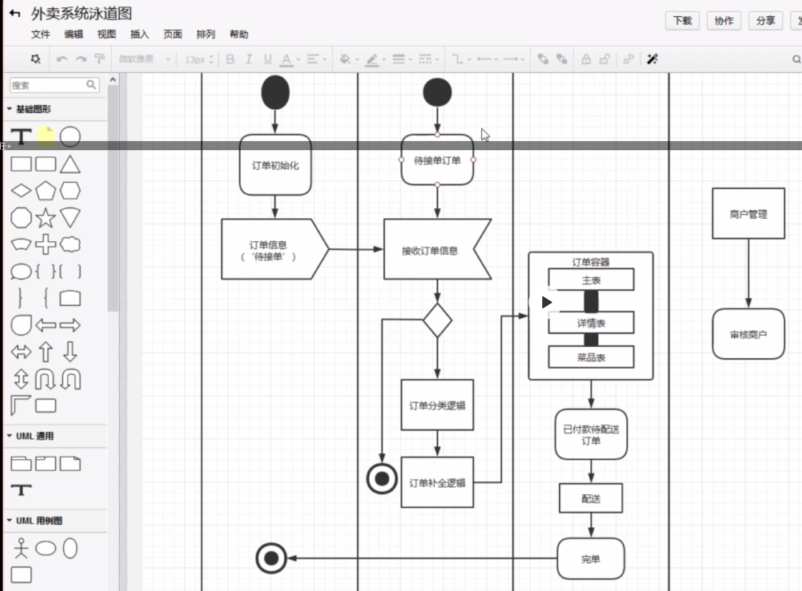
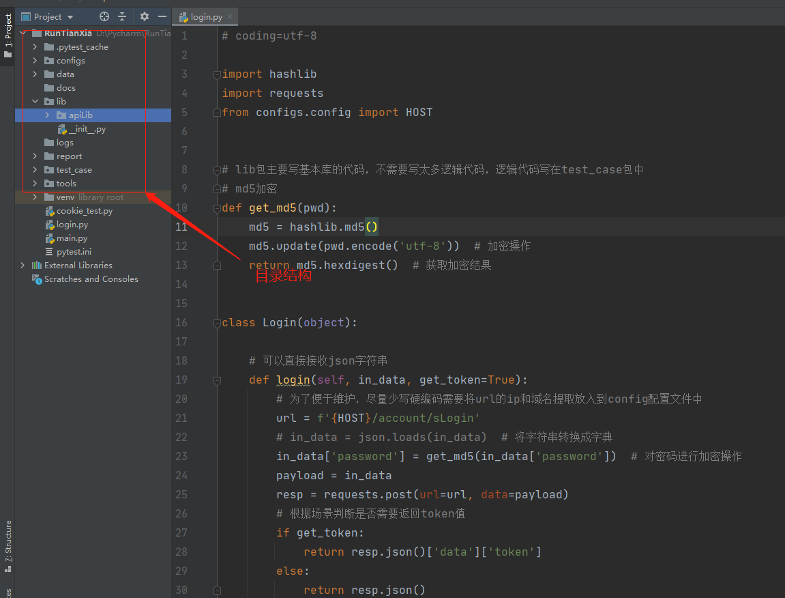

### 1、项目测试需求分析
    
    外卖-商家平台：http://121.41.14.39:8082/shop/index.html#/dashboard
    登录模块
        * 登录操作
        * 登出操作
        * 个人资料修改
    业务管理模块
        * 我的商品
        * 食品管理
        * 我的订单
        * 食品操作
        
    外卖系统：包括四个端（平台管理端、商家端、骑手端、用户端）
    

    这个系统属于前后端分离，使用的是token进行鉴权校验，所有后面的接口都需要经过token的校验

    流程体系
    

### 2、接口自动化测试架构规划

    1、编程语言的选型
        * python
        
    2、编程工具的选型
        * Pycharm
        
    3、自动化测试框架的选型
        * unittest---python解释器自带
        * unittest升级版-pytest
        * unittest升级版-nose
        * httprunner框架
        * rf框架---关键字
        
    4、报告可视化方案的选型
        * htmltestrunner---简单的html报告
        * beautifulreport
        * allure
        
    5、持续方案的选型
        * ci持续集成——>Jenkins
        
    6、仓库服务器的选型
        * github
        * gitlab
        * gitee 码云
        
    7、测试管理工具的选型
        * 禅道
        * jira
        
### 3、项目代码工程创建

    包：代码需要import 导入
    文件夹：可以使用路径获取的
    
    libs：基本代码库包、(common)
    configs：配置包
    data：数据/用例文件夹（yaml格式文件）
    logs：日志文件夹
    test_case：测试用例代码包
    report：报告文件夹
    docs：项目相关文档文件夹
    tools：常规方法包
    
### 大致期望结果
    全自动执行（而不是硬编码）
    分层
        * 用例层
        * 数据层
            - 测试数据
            - 配置参数数据
        * 调度层
            -不需要全部执行接口时可定制化执行
        * 执行层
            -执行效率（多线程和分布式）
            

            
            
        
    

        