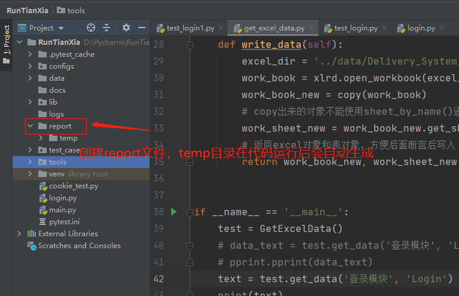
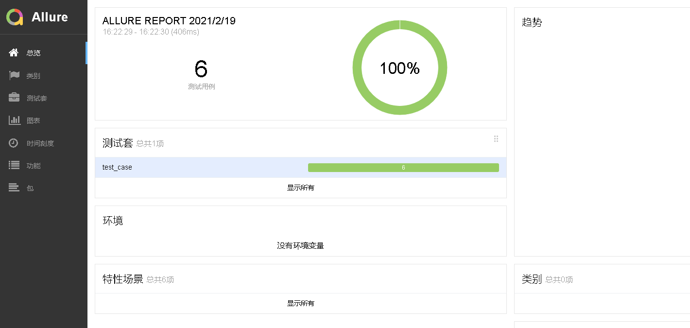
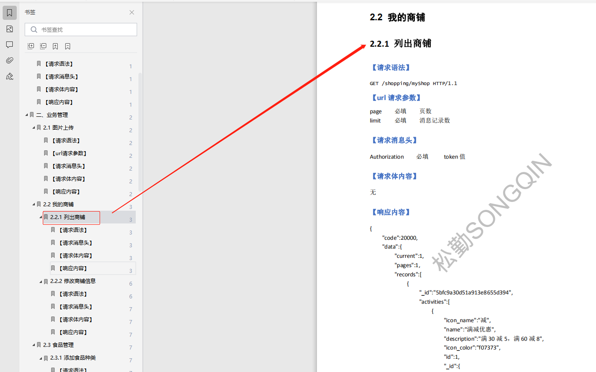
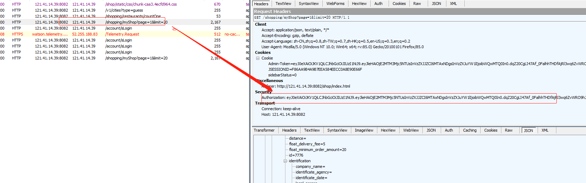
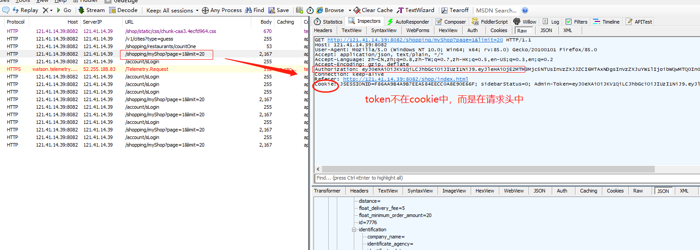

### Pytest自动化框架简介
    
    * python的第三方单元测试框架，比自带的unittest更高效和简介，
      支持315种以上的插件，同时兼容unittest框架
    * unnitest框架迁移到pytest框架的时候不需要重写代码
    * 纯python代码的自动化测试框架
    
### Pytest框架注意事项
    
    * .py文件必须以test_开头（或者以_test结尾）
    * 测试类必须以Test开头，并且不能有init方法
    * 测试方法必须以test开头
    * 断言必须使用assert
    
### Pytest环境搭建
    
    * 首先使用pip安装pytest
        pip install pytest
        pip install pytest-html 原生态报告模板
        
    * 查看是否安装成功
        pip show pytest
        
### pytest框架使用

    简单案例使用pytest
    
```python
# coding=utf-8
# @File     : test_login.py
# @Time     : 2021/2/3 15:01
# @Author   : jingan
# @Email    : 3028480064@qq.com
# @Software : PyCharm

import pytest
from lib.apiLib.login import Login


# 类名以Test开头
class TestLogin(object):

    login = Login()

    # 测试方法以test开头
    def test_login(self):
        # 从lib库调用需要测试的模块，获取响应数据
        res = self.login.login('''{"username": "md0144", "password": "lja199514"}''', get_token=False)
        # pytest框架只能使用assert断言
        assert res['msg'] == '成功'
        print('---pass---')

if __name__ == '__main__':
    # -s 输出打印信息；-q简化输出 pytest.main(模块名称, 输出打印信息)运行
    pytest.main(['test_login.py', '-s'])

"""
test_login.py ---开始执行自动化测试---
---pass---
.---自动化执行结束---

============================== 1 passed in 0.11s ==============================
"""
```

    使用Pytest进行数据驱动（参数化）就是将一些需要传入数据的位置定义为参数，而不是硬编码
    
    参数化定义代码如下
    
```python
# coding=utf-8
# @File     : test_login.py
# @Time     : 2021/2/3 15:01
# @Author   : jingan
# @Email    : 3028480064@qq.com
# @Software : PyCharm
import json
import pytest
from lib.apiLib.login import Login
from tools.get_excel_data import GetExcelData


class TestLogin(object):

    login = Login()
    get_excel_data = GetExcelData()

    # parametrize('变量', 值)的形式，传入多少个变量就对应几个值
    # 'in_data, resp_data'变量表示一个元组，对应传入的get_excel_data.get_data('登录模块', 'Login')返回值也是一个元组
    @pytest.mark.parametrize('in_data, resp_data', get_excel_data.get_data('登录模块', 'Login'))
    # 对应传入上面的两个参数到test_login()中，in_data参数用于登录，resp_data参数用于后面取值断言
    def test_login(self, in_data, resp_data):
        res = self.login.login(json.dumps(in_data), get_token=False)
        # 接口返回的msg与excel定义的msg对比断言
        assert res['msg'] == resp_data['msg']
        print('---pass---')

if __name__ == '__main__':
    # -s 输出打印信息；-q简化输出 pytest.main(模块名称, 输出打印信息)运行
    pytest.main(['test_login.py', '-s'])

"""
test_login.py ---开始执行自动化测试---
---pass---
.---pass---
.---pass---
.---pass---
.---pass---
.---pass---
.---自动化执行结束---

============================== 6 passed in 0.45s ==============================
"""
```

### Allure报告

    * python主流自动化测试报告插件有三个：HTMLTestRunner、BeautifulReport、Allure
    * Allure是一款轻量级的开源自动化测试报告生成框架，它支持绝大部分测试框架，比如TestNG、Junit、pytest、unittest等
    * pytest框架结合Allure生成格式统一、美观的测试报告
    
### Allure报告环境搭建

    * 下载allure.zip
    * 解压allure.zip到一个目录中
    * 将E:\allure-2.13.3\bin路径添加到环境变量的path中
    * pip install allure-pytest
    * 验证，cmd窗口输入allure回车
    
### pytest结合Allure生成报告

    --alluredir==../report/temp  表示生成allure报告需要的源数据(temp目录是自动生成的)
    allure serve + 路径 表示起服务然后自动打开浏览器（需先设置默认浏览器，最好使用谷歌或火狐）
    
    注意：在本地运行多次代码生成的报告源数据会叠加，可以使用os模块在生成报告前先清除历史数据
    
    先创建一个report文件存放temp源数据
    


```python
# coding=utf-8
# @File     : test_login.py
# @Time     : 2021/2/3 15:01
# @Author   : jingan
# @Email    : 3028480064@qq.com
# @Software : PyCharm
import os
import json
import pytest
from lib.apiLib.login import Login
from tools.get_excel_data import GetExcelData


class TestLogin(object):

    login = Login()
    get_excel_data = GetExcelData()

    @pytest.mark.parametrize('in_data, resp_data', get_excel_data.get_data('登录模块', 'Login'))
    # 对应传入上面的两个参数到test_login()中，in_data参数用于登录，resp_data参数用于后面取值断言
    def test_login(self, in_data, resp_data):
        res = self.login.login(json.dumps(in_data), get_token=False)
        assert res['msg'] == resp_data['msg']
        print('---pass---')

if __name__ == '__main__':
    # 删除历史重复数据
    for one in os.listdir('../report/temp'):
        if 'json' in one:
            os.remove(f'../report/temp/{one}')
    # --alluredir==../report/temp  生成allure报告需要的源数据
    pytest.main(['test_login.py', '-s', '--alluredir', '../report/temp'])
    # allure serve + 路径 表示起服务后自动打开浏览器
    os.system('allure serve ../report/temp')
```



    生成报告的方案二
        allure generate 生成报告
        os.system('allure generate report/temp -o ./report --clean')
        
### 我的商铺模块接口编写

    接口文档
        注意：列出商铺接口中的请求消息头需要带上token值，进行鉴权
        
     1. lib——>apiLib包中新建myShop.py文件定义模块类
        


```python
# coding=utf-8
# @File     : myShop.py
# @Time     : 2021/2/19 16:42
# @Author   : jingan
# @Email    : 3028480064@qq.com
# @Software : PyCharm
import requests
from configs.config import HOST
from lib.apiLib.login import Login


class MyShop(object):

    login = Login()

    # 列出商铺
    def shop_list(self, in_data, user_info):
        token = self.login.login(user_info)
        header = {'Authorization': token}
        url = f'{HOST}/shopping/myShop'
        payload = in_data
        res = requests.get(url=url, params=payload, headers=header)
        print(res.text)

if __name__ == '__main__':
    shop = MyShop()
    shop.shop_list({'page': 1, 'limit': 20}, '''{"username": "md0144", "password": "lja199514"}''')

"""
{
	"code":20000,
	"data":{
		"current":1,
		"pages":1,
		"records":[
			{
				"_id":"5ff80be7e82886000109d1e4",
				"activities":[
                ......
	},
	"flag":"松勤教育",
	"msg":"成功",
	"success":false
}
"""
```

    优化上面的代码：因为我的商铺模块中的列出商铺、修改商铺接口的请求头都需要token值鉴权
    所以可以将请求消息头中的token初始化，只要请求了我的商铺模块的接口都先初始化token传入
    
    注意：
        * 抓包查看token值，是在header请求头里还是在cookie里
        * lib库里接口代码不要关联登录模块，意思就是不要使用上面的方法去关联登录，只需要在单元测试时传入用户信息获取token即可
    




    优化代码如下

```python
# coding=utf-8
# @File     : myShop.py
# @Time     : 2021/2/19 16:42
# @Author   : jingan
# @Email    : 3028480064@qq.com
# @Software : PyCharm
import requests
from configs.config import HOST
from lib.apiLib.login import Login


class MyShop(object):

    def __init__(self, in_token):
        self.header = {'Authorization': in_token}

    # 列出商铺
    def shop_list(self, in_data):
        url = f'{HOST}/shopping/myShop'
        payload = in_data
        res = requests.get(url=url, params=payload, headers=self.header)
        # print(res.text)
        return res.json()

if __name__ == '__main__':
    # 登录获取token值
    token = Login().login('''{"username": "md0144", "password": "lja199514"}''')
    # 初始化传入token
    shop = MyShop(token)
    # 请求列出商铺接口
    text = shop.shop_list({'page': 1, 'limit': 20})
    print(text)
```

    2. test_case包中新建test_myShop.py文件定义测试类
    
```python
# coding=utf-8
# @File     : test_myShop.py
# @Time     : 2021/2/19 19:28
# @Author   : jingan
# @Email    : 3028480064@qq.com
# @Software : PyCharm
import os
import pytest
from lib.apiLib.myShop import MyShop
from lib.apiLib.login import Login
from tools.get_excel_data import GetExcelData


class TestMyShop(object):

    get_excel_data = GetExcelData()

    # 每个类下面所有的方法调用只运行一次，有七个我的商铺接口，但也只初始化一次登录
    def setup_class(self):
        self.token = Login().login('''{"username": "md0144", "password": "lja199514"}''')

    @pytest.mark.parametrize('in_data, resp_data', get_excel_data.get_data('我的商铺', 'listshopping'))
    def test_shop_list(self, in_data, resp_data):
        res = MyShop(self.token).shop_list(in_data)
        # 返回数据中code不是为空的，即存在则根据code值断言，不存在code值则根据error断言
        if res.get('code') is not None:
            assert res['code'] == resp_data['code']
        else:
            assert res['error'] == resp_data['error']

if __name__ == '__main__':
    # 删除历史重复数据
    for one in os.listdir('../report/temp'):
        if 'json' in one:
            os.remove(f'../report/temp/{one}')
    # --alluredir==../report/temp  生成allure报告需要的源数据
    pytest.main(['test_myShop.py', '-s', '--alluredir', '../report/temp'])
    # allure serve + 路径 表示起服务后自动打开浏览器
    os.system('allure serve ../report/temp')
```
    