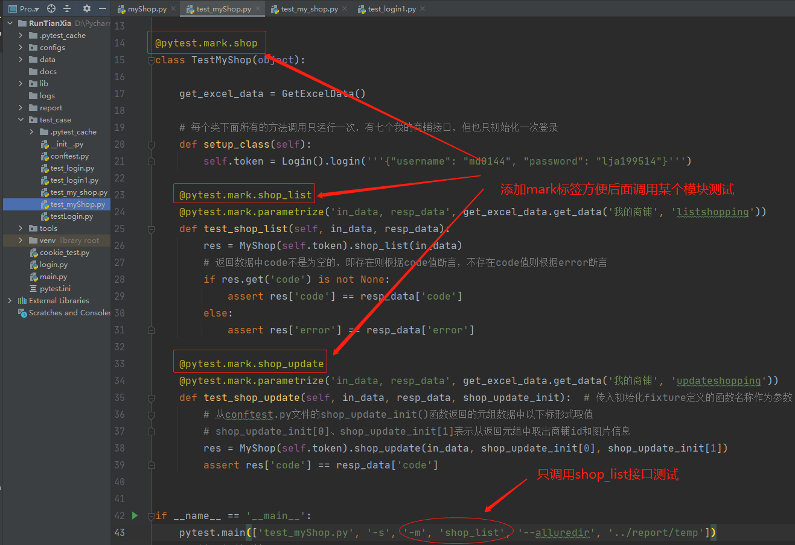
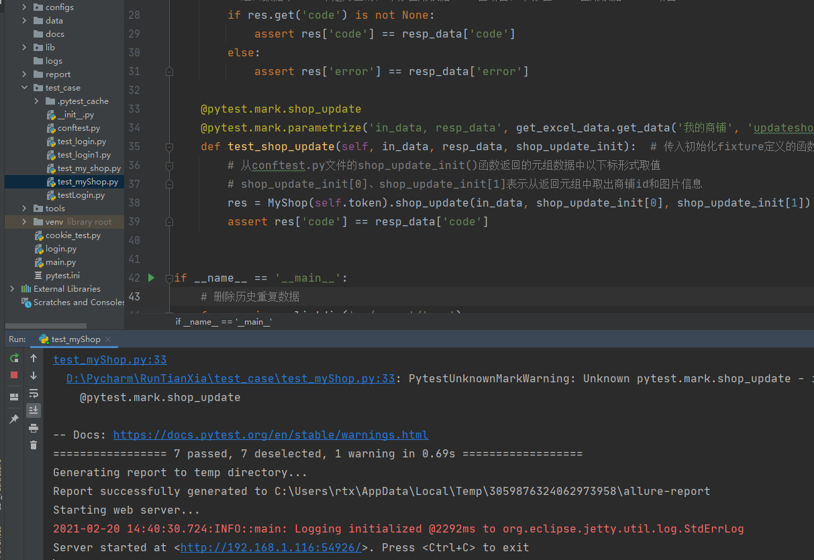
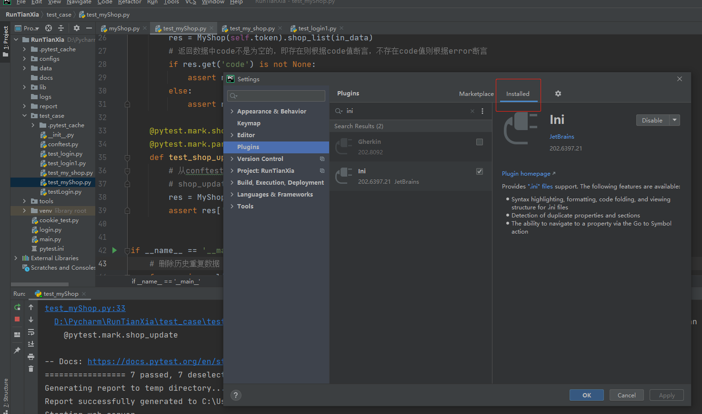
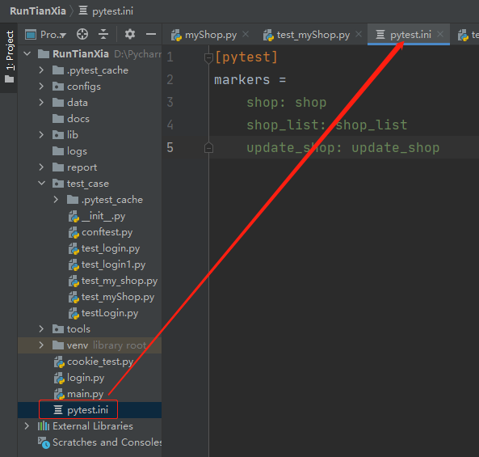
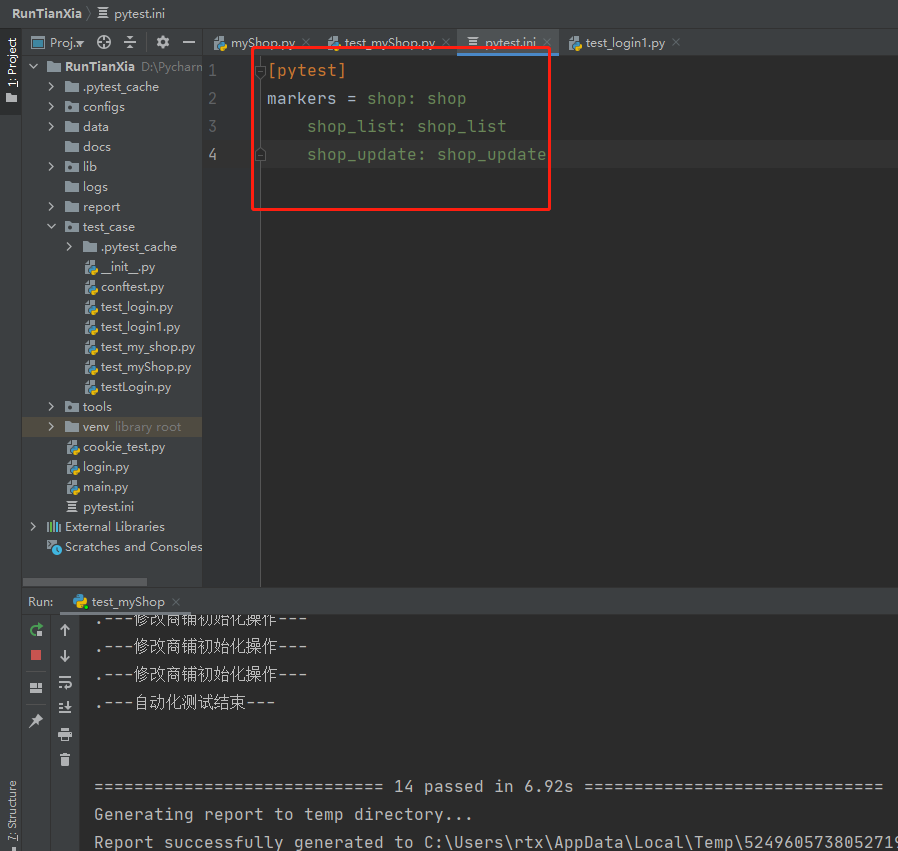

## 用例定制化执行
    
    需求场景：
        在回归测试里面，开发修改一个业务的bug，测试人员需要对对应的业务进行回归测试
        这时候需要筛选出对应的业务模块的部分接口进行部分测试，而不是全部接口重新再次测试

### Pytest框架的mark标签

    allure用例描述
        
|使用方法|参数值|参数说明|
|------|-----|-------|
|@allure.epic()|epic描述|敏捷的概念，定义史诗(即定义整个项目的名称，比如外卖系统)|
|@allure.feature()|模块名称|功能描述(例如：商铺模块)|
|@allure.story()|用户故事|模块中某个接口功能描述(例如：列出商铺接口)|
|@allure.title()|用例标题|重命名html报告名称|
|@allure.testcase()|测试用例的链接地址|对应功能测试用例系统里面的case|
|@allure.issue()|缺陷|对应缺陷管理系统的链接(设置链接跳转到bug页面)|
|@allure.description()|用例描述|测试用例的描述|
|@allure.step()|操作步骤|测试用例的步骤|
|@allure.severity()|用例等级|blocker，critical，normal，minor，trivial|
|@allure.link()|链接|定义一个链接，在测试报告展现|
|@allure.attachment()|附件|报告添加附件|

    * 添加下面标签之前先设置测试类和里面的方法——标签mark
    
        比如我的商铺模块先在类前面添加@pytest.mark.shop(shop名称自定义)
        商铺模块里面的列出商铺和修改商铺信息接口则添加@pytest.mark.shop_list和@pytest.mark.shop_update
        
    * 指定组装某些模块下的用例进行测试
        -m + 定义的mark标签名（shop_list或shop_update）
    
```python
"""
指定一个方法运行
'-m','lesson_add'

指定多个方法运行
 '-m','lesson_add or lesson_list'

排除某个方法运行
'-m','not lesson_add '

排除多个方法运行
'-m','not (lesson_add or lesson_list)'
"""
```
            
    用法如下图所示
    


    对应代码如下
    
```python
# coding=utf-8
# @File     : test_myShop.py
# @Time     : 2021/2/19 19:28
# @Author   : jingan
# @Email    : 3028480064@qq.com
# @Software : PyCharm
import os
import pytest
from lib.apiLib.myShop import MyShop
from lib.apiLib.login import Login
from tools.get_excel_data import GetExcelData


@pytest.mark.shop
class TestMyShop(object):

    get_excel_data = GetExcelData()

    # 每个类下面所有的方法调用只运行一次，有七个我的商铺接口，但也只初始化一次登录
    def setup_class(self):
        self.token = Login().login('''{"username": "md0144", "password": "lja199514"}''')

    @pytest.mark.shop_list
    @pytest.mark.parametrize('in_data, resp_data', get_excel_data.get_data('我的商铺', 'listshopping'))
    def test_shop_list(self, in_data, resp_data):
        res = MyShop(self.token).shop_list(in_data)
        # 返回数据中code不是为空的，即存在则根据code值断言，不存在code值则根据error断言
        if res.get('code') is not None:
            assert res['code'] == resp_data['code']
        else:
            assert res['error'] == resp_data['error']

    @pytest.mark.shop_update
    @pytest.mark.parametrize('in_data, resp_data', get_excel_data.get_data('我的商铺', 'updateshopping'))
    def test_shop_update(self, in_data, resp_data, shop_update_init):  # 传入初始化fixture定义的函数名称作为参数
        # 从conftest.py文件的shop_update_init()函数返回的元组数据中以下标形式取值
        # shop_update_init[0]、shop_update_init[1]表示从返回元组中取出商铺id和图片信息
        res = MyShop(self.token).shop_update(in_data, shop_update_init[0], shop_update_init[1])
        assert res['code'] == resp_data['code']


if __name__ == '__main__':
    # 删除历史重复数据
    for one in os.listdir('../report/temp'):
        if 'json' in one:
            os.remove(f'../report/temp/{one}')
    # --alluredir==../report/temp  生成allure报告需要的源数据
    pytest.main(['test_myShop.py', '-s', '-m', 'shop_list', '--alluredir', '../report/temp'])
    # allure serve + 路径 表示起服务后自动打开浏览器
    os.system('allure serve ../report/temp')
```
    
    消除上面代码运行后的警告：PytestUnknownMarkWarning: Unknown pytest.mark.shop_update - is this a typo? 
    


    1. 先在Pycharm中的file————> settings————>plugins目录下安装“ini”插件
    


    2. 然后在项目下新建一个pytest.ini后缀的文件，注意文件名要固定（这个文件类似于白名单，放入你需要执行的模块）
    


    3. 在pytest.ini定义需要执行的模块格式如下
        
        [pytest]
            markers = 
                mark标签名: 注释
        如下图所示
        



    其他参数用法
    
    -k 匹配用例名称
        匹配：可全名，也可以模糊
        lesson_1.py lesson_2.py------需要指定运行2个
        pytest -k lesson
        
    -v 节点--多层化
        示例：
            test_lesson.py::TesLesson::test_lesson_add # 测试文件::测试类::测试方法
        pytest -v 
        test_lesson.py::TesLesson::test_lesson_add
        
    -sq:简化打印信息
        -s 输出打印
        -q 简化打印信息

    跳过/条件跳过
        在我们自动化测试过程中，经常会遇到功能阻塞、功能未实现、环境等一系列外部因素问题导致的一些用例执行不了，这时我们就可以用到跳过skip用
        例，如果我们注释掉或删除掉，后面还要进行恢复操作
        
        pytest.main(['-rs','test01.py']) 用-rs执行，跳过原因才会显示SKIPPED [1] test01.py:415: 跳过Test类，会跳过类中所有方法
        
        跳过--skip-------相当于注释的效果跳过测试函数的最简单方法是使用跳过装饰器标记它，可以传递一个可选的原因

        有条件的跳过--skipif---在执行过程中会对项目的一些前置条件进行判断
            **如果您希望有条件地跳过某些内容，则可以使用skipif代替，if条件为真，跳过
            
        skip一般用于接口出问题不需要执行，或者前置条件无法获取跳过此用例不执行   
        
```python
# skip无条件跳过装饰器
@pytest.mark.skip(reason='无条件跳过此用例')
   
# skipif有条件跳过
@pytest.mark.skipif(1==2, reason='为真则跳过')
```
        
