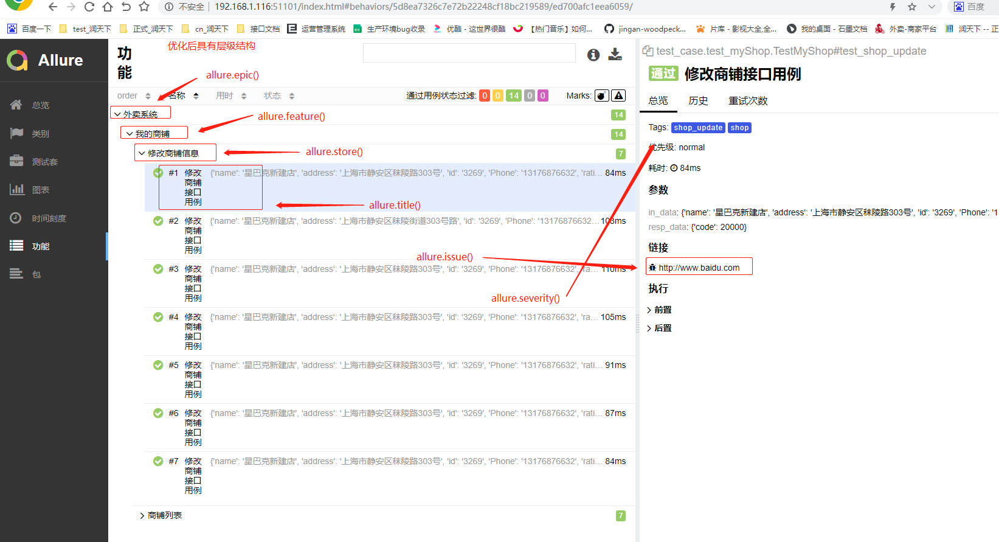
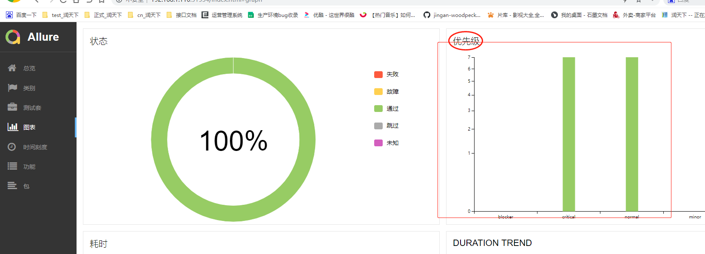

### Allure报告详情

    * 做功能测试的时候，执行完一轮测试用例，输出测试报告时会统计缺陷数量和等级
    * 做自动化测试的过程中，当你的测试用例越来越多的时候，如果执行一轮测试发现
      了几个测试不通过，希望可以尽快统计出缺陷的等级
    * pytest结合allure框架可以对用例的等级做详细的划分
    
### Allure用例描述

    allure用例描述
        
|使用方法|参数值|参数说明|
|------|-----|-------|
|@allure.epic()|epic描述|敏捷的概念，定义史诗(即定义整个项目的名称，比如外卖系统)|
|@allure.feature()|模块名称|功能描述(例如：商铺模块)|
|@allure.story()|用户故事|模块中某个接口功能描述(例如：列出商铺接口)|
|@allure.title()|用例标题|重命名html报告名称(接口中每个用例的标题)|
|@allure.testcase()|测试用例的链接地址|对应功能测试用例系统里面的case|
|@allure.issue()|缺陷|对应缺陷管理系统的链接(设置链接跳转到bug页面)|
|@allure.description()|用例描述|测试用例的描述|
|@allure.step()|操作步骤|测试用例的步骤|
|@allure.severity()|用例等级|blocker，critical，normal，minor，trivial|
|@allure.link()|链接|定义一个链接，在测试报告展现|
|@allure.attachment()|附件|报告添加附件|

    * 执行前先import导入allure，代码如下所示
    
```python
# coding=utf-8
# @File     : test_myShop.py
# @Time     : 2021/2/19 19:28
# @Author   : jingan
# @Email    : 3028480064@qq.com
# @Software : PyCharm
import allure
import os
import pytest
from lib.apiLib.myShop import MyShop
from lib.apiLib.login import Login
from tools.get_excel_data import GetExcelData

@allure.epic('外卖系统')  # 定义整个项目的名称，写在类前面
@allure.feature('我的商铺')  # 对一个接口的模块进行定义名称
@pytest.mark.shop
class TestMyShop(object):

    get_excel_data = GetExcelData()

    # 每个类下面所有的方法调用只运行一次，有七个我的商铺接口，但也只初始化一次登录
    def setup_class(self):
        self.token = Login().login('''{"username": "md0144", "password": "lja199514"}''')

    @allure.issue('http://www.baidu.com')  # 设置对应的缺陷记录跳转链接
    @allure.severity('normal')  # 定义接口的等级
    @allure.title('列出商铺接口用例')  # 定义列出商铺接口下每个用例的标题名称
    @allure.story('商铺列表')  # 定义我的商铺模块中列出商铺接口名称
    @pytest.mark.shop_list
    @pytest.mark.parametrize('in_data, resp_data', get_excel_data.get_data('我的商铺', 'listshopping'))
    def test_shop_list(self, in_data, resp_data):
        """
        测试用例描述：该接口主要是返回外卖商家平台——我的商铺页面列表中所有的店铺信息
        """
        res = MyShop(self.token).shop_list(in_data)
        # 返回数据中code不是为空的，即存在则根据code值断言，不存在code值则根据error断言
        if res.get('code') is not None:
            assert res['code'] == resp_data['code']
        else:
            assert res['error'] == resp_data['error']

    @allure.issue('http://www.baidu.com')
    @allure.severity('critical')
    @allure.title('修改商铺接口用例')
    @allure.story('修改商铺信息')
    @pytest.mark.shop_update
    @pytest.mark.parametrize('in_data, resp_data', get_excel_data.get_data('我的商铺', 'updateshopping'))
    def test_shop_update(self, in_data, resp_data, shop_update_init):  # 传入初始化fixture定义的函数名称作为参数
        """
        测试用例描述：该接口主要是编辑修改店铺名称、详细信息等
        """
        # 从conftest.py文件的shop_update_init()函数返回的元组数据中以下标形式取值
        # shop_update_init[0]、shop_update_init[1]表示从返回元组中取出商铺id和图片信息
        res = MyShop(self.token).shop_update(in_data, shop_update_init[0], shop_update_init[1])
        assert res['code'] == resp_data['code']


if __name__ == '__main__':
    # 删除历史重复数据
    for one in os.listdir('../report/temp'):
        if 'json' in one:
            os.remove(f'../report/temp/{one}')
    # --alluredir==../report/temp  生成allure报告需要的源数据
    pytest.main(['test_myShop.py', '-s', '-m', 'shop', '--alluredir', '../report/temp'])
    # allure serve + 路径 表示起服务后自动打开浏览器
    os.system('allure serve ../report/temp')
```

### 对应的Allure报告样式
    


    测试描述内容可以做在代码中在三引号里填写，同样会同步到allure报告中
    设置了用例等级，在allure报告中会显示对应的图表占比
    代码如上所示
    




    allure报告页面中的样式设置
        
        * 因为打开allure报告是服务层的，所以使用环境配参来设置
        * report————>temp目录下新建environment.properties文件
        * 在文件中填入需要展示的环境数据
   


    总结：按重要性级别进行一定范围的测试
        
        场景：通常测试有P0，冒烟测试，验证上线测试，比如明天上线就需要把主流程和重要模块测试跑一遍
    
    
    
    

    

