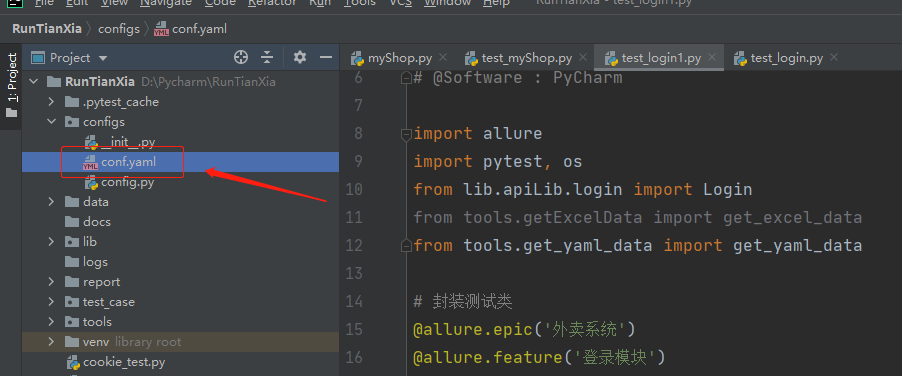

### Yaml文件简介

    * Yet Another Markup Language的缩写
    * Yaml是专门用来写配置文件的语言，非常简介和强大，远比JSON格式方便
    * 可以用作自动化测试框架配置文件或用例文件
    
### Python搭建Yaml环境
    
    * PyYaml是Python的一个专门针对yaml文件操作的模块，使用简单
    * 命令窗口输入：pip install PyYaml 安装
    * 注意：不用open方法打开yaml文件，所以采用安装这个模块
    * PyYaml5.1之后，通过禁止默认加载程序（FullLoader）执行任意功能，load函数也变的更加安全
    
### Yaml格式语法

    基本规则
        大小写敏感
        使用缩进表示层级关系
        缩进时不允许使用Tab，只允许使用空格
        缩进的空格数目不重要，只要相同层级的元素左对齐即可
        # 表示注释，从它开始到行尾都被忽略
        
    1. 在configs包中新建conf.yaml文件



    conf.yaml文件中输入数据
    
```yaml
# yaml转字典
name: test
age: 26
sex: 男
```

    2. 在tools工具包中新建get_yaml_data.py文件，编写代码获取conf.yaml文件的数据
    
```python
# coding=utf-8
# @File     : get_yaml_data.py
# @Time     : 2021/2/5 16:16
# @Author   : jingan
# @Email    : 3028480064@qq.com
# @Software : PyCharm
import yaml


def get_yaml_data(file_dir):
    """
    原则：尽量少修改代码
    1: 获取什么数据
        data
        resp
    2: 数据该如何组装返回
        分析：框架pytest需要什么格式数据
            1- 列表格式 [(),()]
            2- 要求是字典格式
    :param file_dir: 表示需要读取的yaml文件路径
    :return:
    """
    res_list = []
    # 内存中打开yaml文件
    fo = open(file_dir, 'r', encoding='utf-8')
    # 使用第三方库获取
    res = yaml.load(fo, Loader=yaml.FullLoader)  # 处理警告
    print(res)


if __name__ == '__main__':
    get_yaml_data('../configs/conf.yaml')

"""
{'name': 'test', 'age': 26, 'sex': '男'}
"""
```

    yaml中定义数据的其他类型
    
    * yaml转列表
    
```yaml
# 下面的格式读取到python是列表
- 灰色
- 100
- Test

# python读取后结果
# ['灰色', 100, 'Test']
```
    * yaml复合结构
    
```yaml
# yaml复合结构，列表中包含字典
- name: tom
  age: 28
  sex: 男
- name: james
  age: 18
  sex: 女

# python读取后结果
# [{'name': 'tom', 'age': 28, 'sex': '男'}, {'name': 'james', 'age': 18, 'sex': '女'}]
```

```yaml
# yaml字典包含列表
info:
  - 10
  - 20
  - 30
data:
  - 1000
  - 2000
  - 3000

# python读取后结果
# {'info': [10, 20, 30], 'data': [1000, 2000, 3000]}
```
    注意：
    
        * 这里要注意单引号和双引号的区别，单引号中的特殊字符转到Python会被转义，也就是到最后是原样输出了，
          双引号不会被Python转义，到最后是显示特殊字符；
        
        * 如果数据是整型，但要求需要是字符串则需要加上双引号

        * yaml加引号时，一般都使用双引号，因为yaml语法不是Python独有的，java的单引号是字符char，双引号才是字符串，迁移就出错
        
### yaml基本类型

    字符串
    整型
    浮点型
    布尔型
    null
    时间
    日期
    
```yaml
# yaml基本类型
str: 'hello world'
int: 110
float: 3.14
boolean: true  # or false
None: null # 也可以用 ~ 号表示null
time: 2016-09-22t11:43:30.20+08:00  # ISO8601，写法百度
date: 2020-01-01

# python读取后结果
# {'str': 'hello world', 'int': 110, 'float': 3.14, 'boolean': True, 'None': None, 'time': datetime.datetime(2016, 9, 22, 11, 43, 30, 200000, tzinfo=datetime.timezone(datetime.timedelta(seconds=28800))), 'date': datetime.date(2020, 1, 1)}
```

    “---”符号用来分割多个yaml文件
    注意Python文件中读取多个时需要使用load_all
    
    代码如下所示
    
```yaml
---  # 分割多个yaml文件符号
- 1000
- 2000
- 3000

---
name: test
age: 26
sex: 男
```

```python
# coding=utf-8
# @File     : get_yaml_data.py
# @Time     : 2021/2/5 16:16
# @Author   : jingan
# @Email    : 3028480064@qq.com
# @Software : PyCharm
import yaml


def get_yamls_data(file_dir):
    # 一个文件包含多个yaml，使用load_all()
    fo = open(file_dir, 'r', encoding='utf-8')
    # 使用第三方库获取
    res = yaml.load_all(fo, Loader=yaml.FullLoader)
    for one in res:
        print(one)


if __name__ == '__main__':
    get_yamls_data('../configs/conf.yaml')

"""
[1000, 2000, 3000]
{'name': 'test', 'age': 26, 'sex': '男'}
"""
```
    yaml中使用&和*进行引用
    
```yaml
HOST: &HOST 121.41.14.39  # &HOST表示121.41.14.39
url: *HOST  # *HOST表示调用

# python读取后结果
# {'HOST': '121.41.14.39', 'url': '121.41.14.39'}
```

    yaml中使用dump()和dump_all()方法写入
    可以传入列表，也可以传入一个可序列化生成器，如range(10)
    