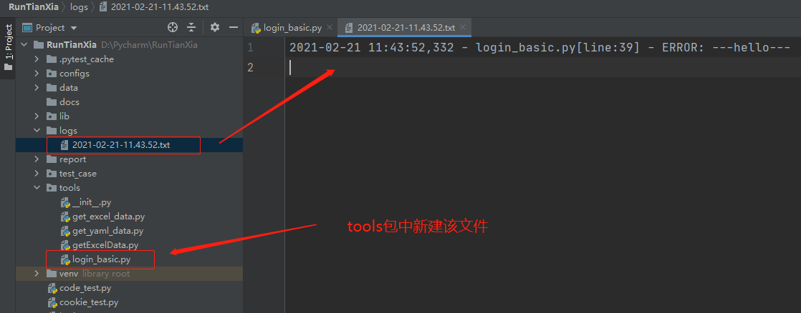
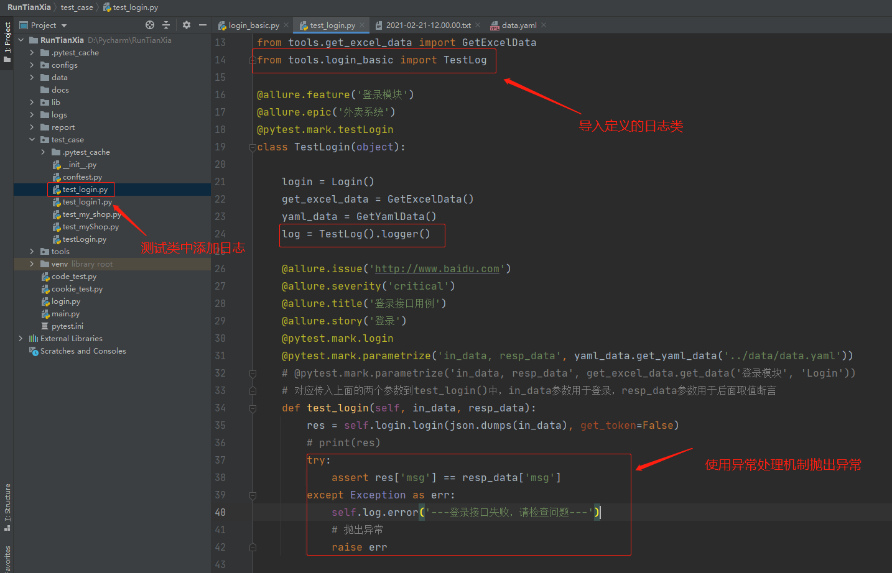
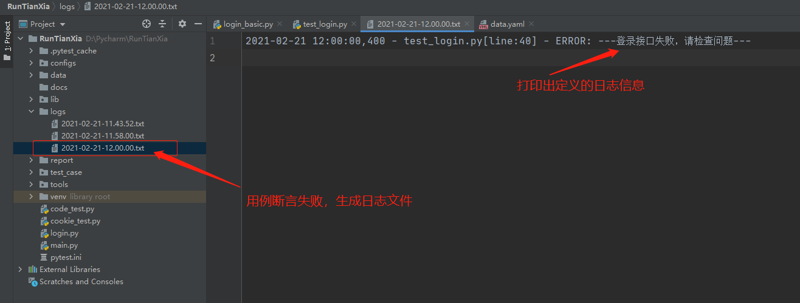
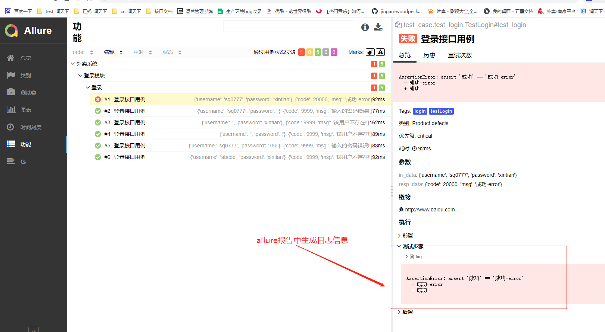

### 日志的引用

    日志是脚本在运行过程中记录下来的信息，对于测试来讲有些bug是无法手工复现的
    脚本错误信息对于定位bug是至关重要的
    
```python
# coding=utf-8
# @File     : log_test.py
# @Time     : 2021/2/20 21:38
# @Author   : jingan
# @Email    : 3028480064@qq.com
# @Software : PyCharm
import logging
import datetime


logging.basicConfig(format='%(asctime)s - %(filename)s[line:%(lineno)d] - % (levelname)s: %(message)s', 
                    filename=f'../logs/{datetime.datetime.now().strftime("%Y-%m-%d-%H.%M.%S")}.txt', level=logging.INFO, filemode='a')
```
    
    logging.basicConfig函数各参数：
    
        * filename：指定日志文件名；
        * filemode：和file函数意义相同，指定日志文件的打开模式，'w'或者'a'；
        * format：指定输出的格式和内容，format可以输出指定的日志信息
        
|参数|作用|
|---|---|
|%(levelno)s|打印日志级别的数值|
|%(levelname)s|打印日志级别的名称|
|%(pathname)s|打印当前执行程序的路径，其实就是sys.argv[0]|
|%(filename)s|打印当前执行程序名|
|%(funcName)s|打印日志的当前函数|
|%(lineno)d|打印日志的当前行号|
|%(asctime)s|打印日志的时间|
|%(thread)d|打印线程ID|
|%(threadName)s|打印线程名称|
|%(process)d|打印进程ID|


### 日志级别

|级别|日志函数|描述|
|DEBUG|logging.debug()|最低级别，追踪问题使用|  
|INFO|logging.info()|记录程序中一般事件信息，或确认一切工作正常|
|WARNING|logging.warning()|记录信息用于警告| 
|ERROR|logging.error()|用于记录程序报错信息|
|CRITICAL|loggin.critical()|最高级别，记录可能导致程序崩溃错误| 
    
    五种日志级别按从低到高排序：DEBUG < INFO < WARNING < ERROR < CRITICAL
    
    注意：可以通过level参数，设置不同的日志级别。当设置为高的日志级别时，低于此级别的日志不再打印
    示例如下
    
```python
# coding=utf-8
# @File     : login_basic.py
# @Time     : 2021/2/21 11:09
# @Author   : jingan
# @Email    : 3028480064@qq.com
# @Software : PyCharm
import logging
import datetime


# 日志设置
"""
1. 存放路径
2. 日志文件名
3. 内容格式：format
    2020-01-01-12:00:00 - log_basic.py [代码错误的行号] 级别: 具体内容
    执行时间 文件名 报错行号 等级 message（具体信息）
"""
class TestLog(object):


    def logger(self):

        """
        filename：指定日志文件名；
        filemode：和file函数意义相同，指定日志文件的打开模式，'w'或者'a'；(a表示追加写)
        format：指定输出的格式和内容，format可以输出指定的日志信息（一般带上日期datetime）
        """
        # 调用配置函数
        logging.basicConfig(format='%(asctime)s - %(filename)s[line:%(lineno)d] - %(levelname)s: %(message)s',
                            filename=f'../logs/{datetime.datetime.now().strftime("%Y-%m-%d-%H.%M.%S")}.txt',
                            level=logging.INFO,
                            filemode='a')
        return logging

if __name__ == '__main__':
    log_txt = TestLog()
    # 要设置比上面INFO等级高的日志才打印
    log_txt.logger().error('---hello---')

# log文件生成日志文件
"""
2021-02-21 11:43:52,332 - login_basic.py[line:39] - ERROR: ---hello---
"""
```




### log日志关联项目

    日志一般在断言、元素是否存在、超时等位置使用异常处理机制try...excep
    






    代码如下：
        * 先在test_case包的测试类导入tools包中定义的TestLog类
        * 使用异常处理机制try...execept...rasie抛出异常日志信息
        * 报错后在log文件中自动生成日志文件，allure报告中也打印信息
        
```python
# coding=utf-8
# @File     : test_login.py
# @Time     : 2021/2/3 15:01
# @Author   : jingan
# @Email    : 3028480064@qq.com
# @Software : PyCharm
import os
import json
import allure
import pytest
from lib.apiLib.login import Login
from tools.get_yaml_data import GetYamlData
from tools.get_excel_data import GetExcelData
from tools.login_basic import TestLog

@allure.feature('登录模块')
@allure.epic('外卖系统')
@pytest.mark.testLogin
class TestLogin(object):

    login = Login()
    get_excel_data = GetExcelData()
    yaml_data = GetYamlData()
    log = TestLog().logger()

    @allure.issue('http://www.baidu.com')
    @allure.severity('critical')
    @allure.title('登录接口用例')
    @allure.story('登录')
    @pytest.mark.login
    @pytest.mark.parametrize('in_data, resp_data', yaml_data.get_yaml_data('../data/data.yaml'))
    # @pytest.mark.parametrize('in_data, resp_data', get_excel_data.get_data('登录模块', 'Login'))
    # 对应传入上面的两个参数到test_login()中，in_data参数用于登录，resp_data参数用于后面取值断言
    def test_login(self, in_data, resp_data):
        res = self.login.login(json.dumps(in_data), get_token=False)
        # print(res)
        try:
            assert res['msg'] == resp_data['msg']
        except Exception as err:
            self.log.error('---登录接口失败，请检查问题---')
            # 抛出异常
            raise err

if __name__ == '__main__':
    # 删除历史重复数据
    for one in os.listdir('../report/temp'):
        if 'json' in one:
            os.remove(f'../report/temp/{one}')
    # --alluredir==../report/temp  生成allure报告需要的源数据
    pytest.main(['test_login.py', '-s', '--alluredir', '../report/temp'])
    # allure serve + 路径 表示起服务后自动打开浏览器
    os.system('allure serve ../report/temp')
```

