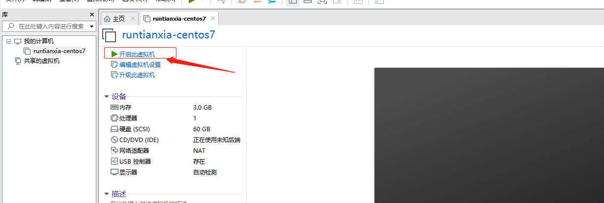
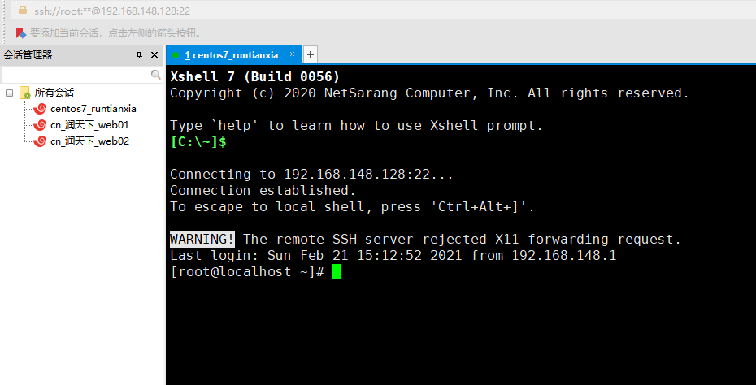
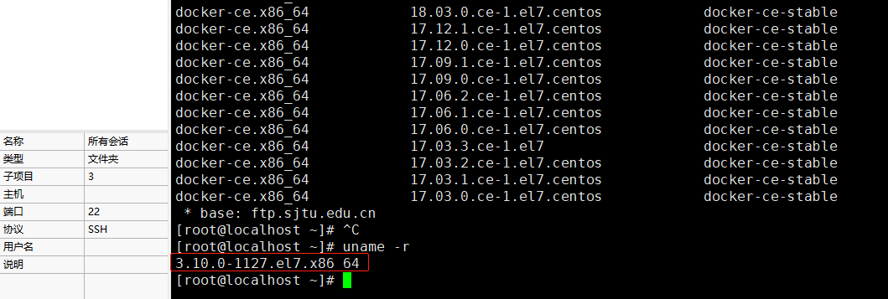

## Docker技术

    首先需要安装以下环境VMware、虚拟机、xshell、xftp
    
### 1、vmware安装和centos7导入

    1. 下载VMware Workstation15安装包
        下载地址：https://download3.vmware.com/software/wkst/file/VMware-workstation-full-15.0.0-10134415.exe
    2. 双击打开后接受协议一直下一步（除了下面的不需要勾选）完成即可
    3. 双击桌面图标，输入激活码：GU5HK-AJG9H-H852Z-DEW7C-MAHYA
    

### 2、导入虚拟机
    
    1. 下载centos7.6
    2. 导入
        * 打开VMware选择打开虚拟机
        

        * 弹窗选择下载好的CentOS-xt.ovf文件导入
        

        * 弹窗设置虚拟机名称和虚拟机存放位置
        
        

        * 点击导入后——弹窗点击重试即可
        
         

        * 开启虚拟机、输入用户名、密码（密码是不明文展示的）
        
   

   

### 3、安装xshell
    
        1. 下载xshell.exe文件双击打开
        2. 接收协议许可一直下一步即可（修改安装路径，填写任意名称）
        

        3. centos虚拟机输入：ifconfig查看ip地址
        

        4. 进入xshell新建会话：主机输入框填写ip地址，名称随意填写
        

        
        5. 用户身份验证输入用户名和密码：与centos用户名root、密码一致
        

        
        
### 4、安装xftp
    
        与xftp安装过程类似
        
### Docker技术简介

    * Docker是开放源代码软件项目，基于Go语言
    * Docker可以让开发者打包他们的应用以及依赖包到一个轻量级、可移植的容器中
    * Docker打包好了的容器，可以发布到任何流行的Linux机器上，也可以实现虚拟化
    * 容器是完全使用沙箱机制，相互之间不会有任何接口（类似于ipthon的app）
    * Docker容器性能开销极低（关键）
    * Docker从17.03后分为CE社区版和EE企业版
    * Docker使用客户端-服务端（C/S)架构模式，使用远程API来管理和创建Docker容器
    
### Docker应用场景
    
    * Web应用的自动化打包和发布
    * 自动化测试和持续集成、发布
    * 在服务型环境中部署和调整数据库或其他的后台应用（为基于微服务开发的项目提供了很好的平台）
    * 使用Docker可以实现开发人员的开发环境、测试人员的测试环境、运维人员的生产环境的一致性
    

    Docker借鉴了标准集装箱的概念
    
        标准集装箱将货物运往世界各地，Docker将这个设计运用到自己的设计中，唯一的不同是
        集装箱运输货物，而Docker运输软件
        
        如果后面的镜像需要添加新的数据可以通过挂载（xftp）
        
### Docker与传统VM对比（都是虚拟化技术）
    
    传统虚拟机技术基于安装在主操作系统上的虚拟机管理系统（如：VirtualBox和VMWare等）
    创建虚拟机（虚拟出各种硬件），在虚拟机上安装操作系统，在这个虚拟操作系统中安装部署各种应用
    总结来说就是相当于另一台虚拟的电脑
    
    虚拟机开销大耗资源、如果软件安装错误就很可能需要重新卸载安装或者还原，不好定位问题
           
        
   

    Docker容器是在操作系统层面上实现虚拟化，直接复用本地主机的操作系统，
    而传统虚拟机则是在硬件层面上实现虚拟化，与传统虚拟机相比，Docker优势体现为启动速度快，占用体积小
    
    * 共享了本机系统的部分应用，所以启动速度快（几秒或几十毫秒），VM一般几十秒或几分钟
    * VM占用大概几个G，docker大概几十mb
    * docker宿主机：你的docker安装在哪一个机器，那个机器就是宿主机
    

### Docker的组成

    
        

|名称|说明|
|---|---|
|Docker镜像(Images)|用于创建Docker容器模板，相当于python类概念，静态的，不能直接使用|
|Docker容器(Container)|是通过镜像创建的，相当于实例的概念，是动态的，可以访问的|
|Docker客户端(Client)|通过命令行或其他工具使用DockerAPI与Docker守护进程通信|
|Docker主机(HOST)|一个物理或者虚拟的机器用于执行Docker容器的运行以及镜像的管理|
|Docker守护进程|是Docker服务器端的进程，负责支撑Docker容器的运行以及镜像的管理|
|Docker仓库/DockerHub|Docker仓库用来存放镜像的地方|

    Docker仓库用来保存镜像，可以理解为代码控制中的代码仓库
    
    DockerHub提供了庞大的镜像集合供使用，用户也可以将自己本地的镜像推送到Docker仓库供别人下载
    
    比如我有一套自动化环境，打包好一个模板（镜像）放在阿里云里面，其他用户只要把这个模板下载到本地
    就可以根据这套环境创建很多不同的自动化测试环境（也就是容器A、容器B......）
    
    Docker守护进程意思就是即使stop退出了这个服务器端依然可以运行
    
    * Docker镜像可以理解为创建Docker容器的模板（静态只可读），相当于是一个root文件系统。
      镜像和容器的关系，就像面向对象编程设计中的类和实例一样的，镜像是静态的定义，容器是镜
      像运行时的实体
      
    * 容器是一个运行时环境，是镜像的一个运行状态，它是镜像执行的动态表现。容器可以被创建、
      启动、删除、停止、暂停等。Docker容器通过Docker镜像来创建
      
### Docker操作

    centos下安装docker
    
        1. docker支持centos7和centos8版本或更高
            * 操作系统centos-extras库必须启用，默认情况是启用的，如果禁用了则重新启用
            * docker要求centos系统的内核版本要高于3.10
            * uname -r 查看系统版本
            
      

        2. 安装需要的软件包
            
            yum install -y yum-utils device-mapper-persistent-data lvm2
                
                * yum-utils 是yum仓库管理扩展工具包，提供了yum-config-manager功能
                * 另外两个是devicemapper驱动依赖的
                
        3. 添加yum源(二选一)
            
            一、阿里云镜像仓库
                * yum-config-manager --add-repo http://mirrors.aliyun.com/docker-ce/linux/centos/docker-ce.repo
               
            二、官网源镜像仓库
                * yum-config-manager --add-repo https://download.docker.com/linux/centos/docker-ce.repo
                
            利用yum-config-manager添加yum仓库
            查看仓库: ll /etc/yum.repos.d    
                  
  

        4. 查看仓库中docker的版本，选择对应的版本安装
            yum list docker-ce --showduplicates | sort -r

    

        5. 安装docker(二选一)   
            
            * 方式一安装最新版
                yum install -y docker-ce
                
            * 方式二安装指定版
                yum install docker-ce-版本号（如：17.21.1.ce）
    
        6. 启动docker
        
            systemctl start docker
            
        7. 加入开机启动
        
            systemctl enable docker
            
        8. 验证是否安装成功
            
            docker version
 
### Docker进程相关指令
           
    1. 查看docker有哪些指令
        docker --help
        
    2. 查看docker版本
        docker -v
        
    3. 查看docker 服务端与客户端版本详情
        docker --version
        
    4. 启动docker进程
        systemctl start docker
        
    5. 关闭docker
        systemctl stop docker
        
    6. 重启docker
        systemctl restart docker
        
    7. 查看docker运行状态
        systemctl status docker
        
 
        
    8.  关闭防火墙(最好关闭)
        systemctl stop firewalld # 永久关闭使用disable，暂时关闭用firewalld
    
   
### Docker镜像操作（镜像不存在运行状态）

    目标：操作一个tomcat镜像，实现容器化，宿主机挂载执行war包  
         即实现本地浏览器访问容器里的tomcat，而且可以挂载
    
    1. 查看镜像---本地的
        docker images
        
 
        
    2. 搜索镜像-- 先本地搜索 -- 然后默认的地址搜索
        默认地址添加方式
            默认情况下，docker下载镜像是从官网下载的，下载速度特别慢，使用阿里云加速器可以提升获取docker官方镜像速度
            
        操作方式：
            * 一、在指定目录创建文件（已存在则忽略此操作）
                touch /etc/docker/daemon.json
            * 二、修改文件内容为：
                {
                 "registry-mirrors": ["https://v2c6fjn8.mirror.aliyuncs.com"]
                }
            注意：此网址是从阿里云控制台复制过来的，每个登录用例都不一样
            
            * 三、重启docker服务
                systemctl restart docker
                
 

        NAME表示镜像名称、[OK]表示是官方镜像、STARS星级表示欢迎度
        
     3. 上一步找到镜像后，进行拉取
        
        docker pull tomcat #最新版本
        docker pull tomcat:7#最新版本
        
        拉取成功后再次使用docker images查看镜像(注意是拉取镜像，并不是创建镜像)
                
 

    4. 本地拉取了镜像后才可以创建容器
    
        根据上面拉取tomcat镜像，创建一个名称为myTomcat容器
        docker create --name=myTomcat tomcat  (docker创建一个镜像tomcat的容器，并且命名为myTomcat)
        
    5. 查看容器
    
         docker ps
         
 

        因为docker ps查看是已运行的容器，所以上面查看为空，需要先运行容器再查看
        docker ps -a 查看所有的容器，可以看到状态是created是创建
        
    6. 运行容器
    
        docker start myTomcat  命令start后面也可以跟容器的id（前2-3位）或者name
        运行后容器的状态变为Up
        
    7.  停止容器
        
        docker stop myTomcat 命令start后面也可以跟容器的id（前2-3位）或者name
        运行后容器的状态变为Exited
        
    8. 删除没有运行的容器
    
          docker rm 容器id或者名字
          
    9. 删除在运行的容器
    
         docker rm -f 容器id或者名字
         
    10. 删除所有的容器
        * 先停止所有的容器
            docker stop $(docker ps -a -q)
        * 再删除
            docker rm $(docker ps -a -q)
        
       
    

    
      