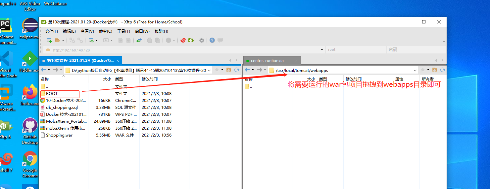

### docker运行容器的一些操作

    1. 查看docker run 命令（可创建并且启动容器，而docker start仅仅是启用）
        docker run --help
            docker run 后面的参数
            
            * -i #运行容器
            * -t #容器启动后，进入命令行
            * -v #目录映射--挂载
            * -d #守护进程--可以在后台运行
            * -p #端口映射 如果容器里有tomcat ，你本机的windows想访问： 
                 docker tomcat 端口号是8080，本机只能访问虚拟机，所以需要先在虚拟机映射一个端口（例如：9099）
                 windows才可以访问http://虚拟机的ip:9099
                 
    2，创建容器，并且进入命令行---进入容器
    
        docker run -it --name=myTomcat tomcat /bin/bash

        

    3. 退出容器
    
        exit
        
    4. 有没有一启动方法，不退出容器
        一、先创建运行一个守护的容器输入命令：docker run -id --name=myTomcat2 tomcat
        二、输入命令进入：docker exec -it myTomcat2 /bin/bash

   

### 宿主机与docker容器的文件传递

    宿主机就是本机
    1. 在宿主机创建一个文件
        touch xt.txt
        
    2. 把该文件复制到容器里去
        docker cp xt.txt myTomcat2:/
        进入根目录查看是否复制文件成功：
        
    3. 进入（容器）根目录
        docker exec -it myTomcat2 /bin/bash
        cd /
    
    4. 查看文件
        ls
        
 
 
### docker容器中的文件拷贝到宿主机

    1. 注意先进入容器终端创建文件
        touch abc.txt 
        
    2. 退出容器
        exit
        
    3. docker cp +容器名称:/文件 /root
    docker cp myTomcat2:/abc.txt /root
    
### 访问tomcat

    1. 启动并且作为守护进程 
    
        * -p 宿主机的端口:容器里应用的端口 8080 
        * war包挂载宿主机命令 
            -v 宿主机的路径（本机创建路径/usr/local/tomcat/webapps）: 容器路径（写上和本机一样的路径方便识别，路径会新建）+ 容器名称
            
            注意：容器的路径/usr/local/tomcat/webapps放war包是默认在webapps中的；
    

        * 本机执行命令：docker run -id --name=myTomcat3 -p 9999:8080 -v /usr/local/tomcat/webapps:/usr/local/tomcat/webapps tomcat
        * 执行命令成功后，在xftp中查看宿主机是否自动生成/tomcat/webapps
       

        * 总结：所以之后的项目war包都可以放在宿主机的/tomcat/webapps的目录下，而不用放容器；启动哪个容器就挂载到哪个目录下
        

        * 在xshell输入命令进入容器查看是否拖拽成功
        

    2. 浏览器访问http://虚拟机ip:9999即可查看tomcat
        虚拟机Ip通过输入ifconfig命令获得
        

        微服务就需要很多容器
        微服务 k8s 项目容器化了，所以需要容器式的性能测试，所以需要监控容器里的服务
        
### 启动容器时关联其他容器 

    docker run -di --name=tomcat2 -p 8080:8080 --link mysql --link redis --link rabbitmq
    
    VM作用：
        docker容器技术最佳是在linux系统中，所以安装了VM虚拟机是为了提供服务器环境（即宿主机）
        不使用VM虚拟机作为服务器，则可使用阿里云服务器（需要收费）