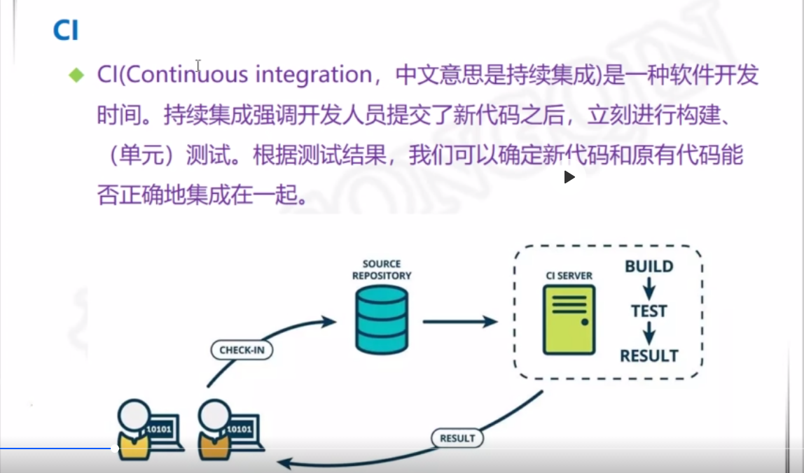
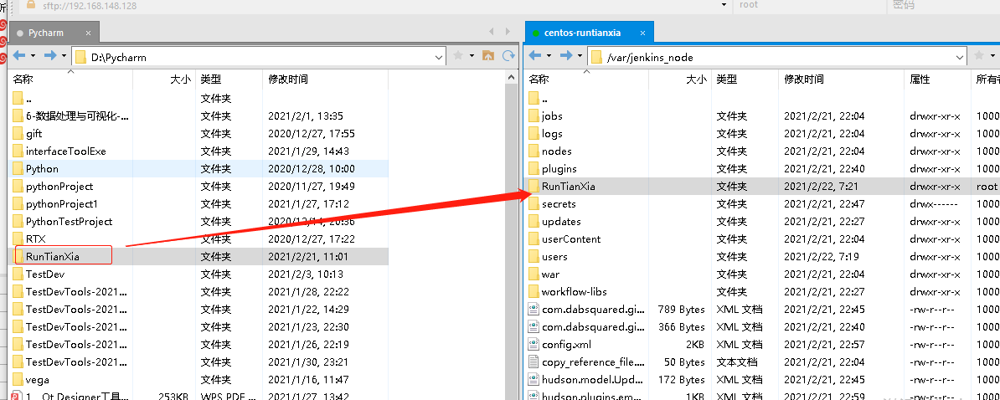
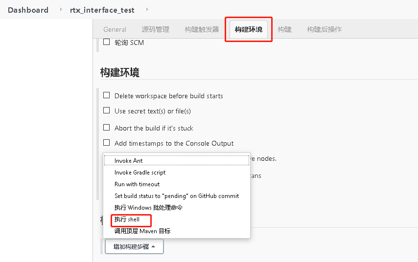

### 持续集成技术（包括开发、测试、预发布、生产环境）

    概述：
        * 持续集成是一种软件开发实践，即团队开发成员经常集成他们的工作，通常
          每个成员每天至少集成一次，也就意味着每天都可能发生多次集成。
         
        * 每次集成都通过自动化的构建（包括编译、发布、自动化测试），来验证，从而
          尽快得发现集成错误，许多团队发现这个过程可以大大减少集成问题，让团队能够
          更快的开发内聚的软件
          
    优点：
        * 维护一个统一的代码库
        * 每天都必须向主干提交代码
        * 每次提交都应立刻在集成环境进行构建
        * 自动化构建、自动化测试、自动化部署
        * 快速、持续构建
        * 构建环境务必与生产环境保持一致
        * 访问权限对团队成员保持公开透明
        
### CI持续集成



### CD持续交付


### Jenkins简介

    Jenkins官网：https://jenkins.io/
    Jenkins下载：http://updates.jenkins-ci.org/
    Jenkins全部镜像：http://mirrors.jenkins-ci.org/status.html


### Jenkins配置操作

    1、安装环境所需插件
    2、配置JDK环境
    3、配置allure环境
    
### 需求

    Jenkins容器化搭建，结合Pytest自动化执行生成Allure报告，发送邮件
    
    1. Jenkins环境搭建与启动
        一、下载镜像
            方案一：搜索docker search jenkins---最新版本
            注意：在这个镜像的创建的容器里需要搭建python环境 （一系列库）
            
            apt指令安装
            
            方案二：可以从一个指定的下载源的镜像拉取就行-- 前提是已经打包好这个镜像---（jenkins+python3+pytest）
            阿里云-公共仓库
            命令格式：docker pull 镜像
                * docker pull registry.cn-hangzhou.aliyuncs.com/sqqdcl/jenkins
                
        二、查看镜像---静态的模板
            镜像--容器的模板--打包好的---静态的概念--使用 的时候请创建容器docker images
            
        三、创建容器
            守护式--- 退出容器的终端，不会exit docker run -id xxxx
            
            注意：需要做目录挂载
                因为jenkins 做很多的插件安装--以及其他设置，如果不做挂载每次删除容器后都要重新安装插件和配置
                
        四、在宿主机的一个目录下创建一个目录，用于挂载目录
            mkdir -p /var/jenkins_node
            
                给一个权限--chmod 777 (0111)可读可写可执行 wrx
                    chmod 777 /var/jenkins_node

  

  
            
           需要什么插件都可以放在这个挂载目录中
            
        五、创建与启动守护式容器---注意容器中的端口使用 8080
           docker run -id --name=rtxjenkins -p 8080:8080 -v /var/jenkins_node:/var/jenkins_home registry.cn-hangzhou.aliyuncs.com/sqqdcl/jenkins
            
        六、查看容器是否启动
           docker ps -a
            
        七、查看宿主机ip
           ifconfig
            
        八、windows机器浏览器访问
           http://宿主机ip:8080/
            
        这种初始化打开jenkins是非常慢的
        出现这个情况时，是因为Jenkins的默认更新镜像用的国外的镜像，把更新镜像改成国内的即可。
        首先打开Jenkins的安装目录， 比如我是安装在D:\Program Files (x86)\Jenkins 这个目录，打开这个目录，
        然后打开hudson.model.UpdateCenter.xml 这个配置文件，
        
        将    <url>https://updates.jenkins.io/update- center.json</url> 
        修改成 <url>http://mirror.xmission.com/jenkins/u pdates/update-center.json</url>
        
        然后打开windows服务管理器，重启Jenkins服务，再重新刷新Jenkins启动页面即可
        
        九、获取管理员密码
            docker logs rtxjenkins 或者进入宿主机目录查看
 
    


### Jenkins结合自动化测试 

       

    1. Jenkins 插件下载
        安装路径：ManagerJenkins——Manage Plugins——可选插件
        安装插件前先设置高级下载源
        
    
        
        安装插件： gitlab 、gitlab HOOK、allure
        安装完重启
        
    

    2. Jenkins 全局工具设置-直接按给的填写即可
    
        需要设置全局 
        * jdk 
        * git 
        * allure   
        
        配置路径：系统管理——全局工具配置
        
        先配置jdk，首先获取路径，别名为JAVA_HOME
     

    
        同理git也是这样配置


        同理allure也是这样配置
        


    3. Jenkins 邮件功能测试
        
        系统配置中设置
        
        邮件发送邮箱账号 songqin_xintian@163.com 
        授权码（注意，不是邮箱密码）所有第三方操作邮件都需要这个授权码WYMBWTZSUEJQTYG
        
  

   

  

    4. python环境验证
    
        在容器里输入 python3  
        查看python环境的安装库 pip3 list
    
   

   

    5. Pytest框架环境验证
        * 进入docker里加pytest软连接
            首先管理员进入容器： docker exec -uroot -it rtxjenkins /bin/bash
            然后加pytest软连接： ln -s /opt/python3/bin/pytest /usr/bin/pytest 
            
        * 软连接是linux中一个常用命令，它的功能是为某一个文件在另外一个位置建立一个不同的链接 
        * 具体用法是：ln -s 源文件 目标文件
        
        * 当我们需要在不同的目录，用到相同的文件时，我们 不需要在每一个需要的目录下都放一个必须相同的文件，
          我们只要在其它的 目录下用ln命令链接（link） 就可以，不必重复的占用磁盘空间
            例如： ln -s /usr/local/mysql/bin/mysql /usr/bin
            
   

    6. 使用jenkins实现自动化测试
       目前方案没有gitlab，后续采用该方案   
       
       * 首先把项目的自动化脚本文件夹放到--宿主机与容器挂载的目录下
       * 使用xftp工具，把本机上的项目拖拽到宿主机/var/jenkins_node挂载目录下
       
   

        上面项目文件拖拽成功后，会自动在容器/var/jenkins_home目录下生成项目
        * 容器下查看
            docker exec -it rtxjenkins /bin/bash
            cd /var/jenkins_home 
            ls          
            


    7. jenkins创建工程
        一、浏览器Jenkins首页点击新建任务
        
 
        
        二、构建一个自由风格的软件项目


        三、进入工程--点击配置
        四、构建环境——选择构建--执行shell
        输入框输入：
        (jenkins_home项目在容器中的名称、RunTianXiat是项目的名称、
        test_case是测试用例包名、pytest -sq是执行命令)
        #!/bin/bash
        cd/var/jenkins_home/RunTianXia/test_case
        pytest -sq 
        五、应用保存、首页点击立即构建
        



        
        六、增加邮件--构建后操作
        Jenkins首页点击配置——选择构建后操作
        
      
        
        Project From输入邮箱：lja199514@163.com
       	Project Recipient List输入接收邮箱的用户：3028480064@qq.com
        Content Type 选择HTML
       	Default Content邮箱模板输入以下代码
       	
```html
<!DOCTYPE html>    
<html>    
<head>    
<meta charset="UTF-8">    
<title>${ENV, var="JOB_NAME"}-第${BUILD_NUMBER}次构建日志</title>    
</head>    
    
<body leftmargin="8" marginwidth="0" topmargin="8" marginheight="4"    
    offset="0">    
    <table width="95%" cellpadding="0" cellspacing="0"  style="font-size: 11pt; font-family: Tahoma, Arial, Helvetica, sans-serif">    
        <tr>    
            本邮件由系统自动发出，无需回复！<br/>            
            各位同事，大家好，以下为${PROJECT_NAME }项目构建信息</br> 
            <td><font color="#CC0000">构建结果 - ${BUILD_STATUS}</font></td>   
        </tr>    
        <tr>    
            <td><br />    
            <b><font color="#0B610B">构建信息</font></b>    
            <hr size="2" width="100%" align="center" /></td>    
        </tr>    
        <tr>    
            <td>    
                <ul>    
                    <li>项目名称 ： ${PROJECT_NAME}</li>    
                    <li>构建编号 ： 第${BUILD_NUMBER}次构建</li>    
                    <li>触发原因： ${CAUSE}</li>    
                    <li>构建状态： ${BUILD_STATUS}</li>    
                    <li>构建日志： <a href="${BUILD_URL}console">${BUILD_URL}console</a></li>    
                    <li>构建  Url ： <a href="${BUILD_URL}">${BUILD_URL}</a></li>    
                    <li>工作目录 ： <a href="${PROJECT_URL}ws">${PROJECT_URL}ws</a></li>    
                    <li>项目  Url ： <a href="${PROJECT_URL}">${PROJECT_URL}</a></li>    
                     <li>测试报告： <a href="${PROJECT_URL}allure">${PROJECT_URL}allure</a></li> 
                </ul>    
<h4><font color="#0B610B">失败用例</font></h4>
<hr size="2" width="100%" />
$FAILED_TESTS<br/>
<h4><font color="#0B610B">最近提交(#$SVN_REVISION)</font></h4>
<hr size="2" width="100%" />
<ul>
${CHANGES_SINCE_LAST_SUCCESS, reverse=true, format="%c", changesFormat="<li>%d [%a] %m</li>"}
</ul>
详细提交: <a href="${PROJECT_URL}changes">${PROJECT_URL}changes</a><br/>
            </td>    
        </tr>    
    </table>    
</body>  
```
        选择高级设置：先把Tirrgers右上角关闭掉，然后新增选择always，意思就是无论成功失败都发送邮件
        可以选择add增加你要发送的人员列表
        
        高级下选择Attach Build Log发送日志
        
    七、构建后操作添加allure report
        输入allure-results
        
    八、执行shell窗口添加allure报告命令和环境数据的输出
        alluredir=${WORKSPACE}/allure-results
        cp /var/jenkins_home/RunTianXia/report/temp/environment.properties ${WORKSPACE}/allure-results/environment.properties
        exit 0

   

      	
       	 