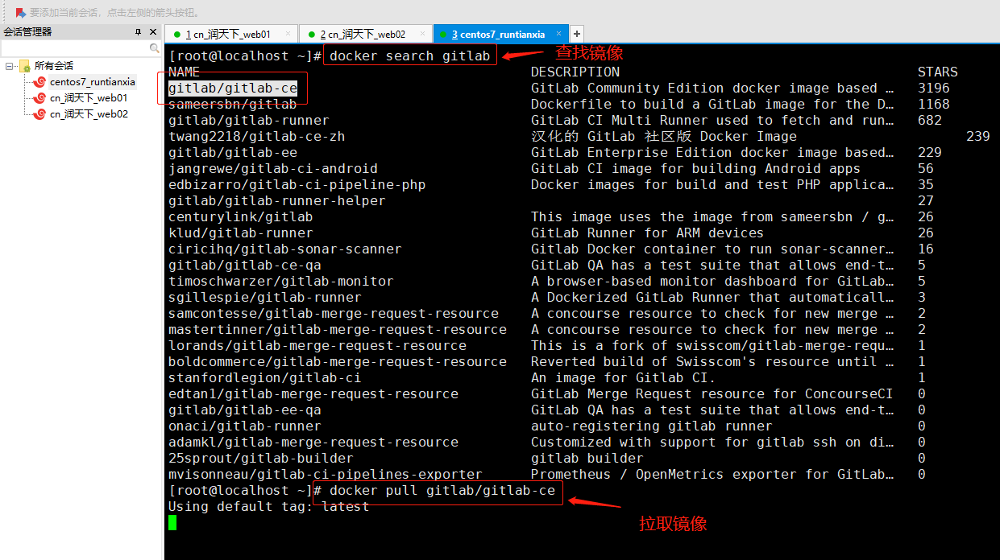

### Git简介

    git是一个版本控制系统，版本控制是一种用于记录一个或多个文件内容
    变化，方便查阅特定版本修订情况的系统
    
### Git与SVN对比

    * SVN是集中式版本控制系统，版本库是集中放在中央服务器的，而开发人员工作
    的时候，用的都是自己的电脑
      所以首先要从中央服务器下载最新的版本，然后开发，开发完成后，需要把自己
    开发的代码提交到中央服务器
    
      集中式版本控制工具缺点：服务器单点故障；容错性差
      
    * Git存在远程仓库和本地仓库：服务器宕机了，可以先放在本地仓库，等待服务器启动再提交
    
### Git工作流程

    1. 克隆远程仓库到本地 clone
    2. 在本地仓库中checkout代码--进行编写
    3. 在提交前到本地仓库前--需要到暂存区 indexstage
    4. 提交到本地仓库 commit
    5. 推送到远程仓库里push
    
    了解Git相关的一些概念
    1. 版本库：其中.git隐藏文件夹就是版本库，版 本库中存储了很多配置信息、日志信息和文件版本信息 等
    2. 工作目录（工作区）：包含.git文件夹的目录就是工 作目录，主要用于存放开发的代码
    3.暂存区：.git文件夹中有很多文件，其中有一个index文件就是暂存区，也可以叫做stage。暂存区是 一个临时保存修改文件的地方
    
### 常用Git代码托管服务对比
    
    1. 常用的Git代码托管服务---远程仓库
        GitHub：服务器在国外；下载特别慢；一般开源的项目多
        
        GitLab：GitLab解决了付费这个问题，你可以在上面创建私人的免费仓库；如果公司自己的服务器搭建仓库，首选gitlab
        
        码云Gitee：是国内的一个代码托管平台，由于服务器在国内，所以相比于GitHub，码云速度会更快
        
### gitlab容器搭建

    gitlab搭建在哪里服务器就在哪里
    
    1. 由于是docker镜像运行, 所以我们需要把gitlab的配置, 数据, 日志存到容器外面, 即将其挂载到宿主机。先准备三个目录
       cd /srv 切到srv目录
       mkdir gitlab 创建gitlab文件夹
       cd gitlab 进入该目录
       mkdir config logs data 创建三个文件夹
       
    2. 根目录下查看镜像docker search gitlab
    
    3. 拉取镜像docker pull gitlab/gitlab-ce
    

    4. 创建运行中容器，设置挂载映射目录
    docker run --detach --publish 443:443 --publish 9001:80 --publish 8022:22 --hostname 虚拟机ip
    --name mygitlab --restart always -v /srv/gitlab/config:/etc/gitlab -v /srv/gitlab/logs:/var/log/gitlab 
    -v /srv/gitlab/data:/var/opt/gitlab -v /etc/localtime:/etc/localtime:ro --privileged=true gitlab/gitlab-ce
    
    其中/srv/gitlab/config:/etc/gitlab -v /srv/gitlab/logs:/var/log/gitlab -v /srv/gitlab/data:/var/opt/gitlab -v为挂载目录
    /etc/localtime:/etc/localtime:ro --privileged=true gitlab/gitlab-ce表示时间同步
    
    5. 关闭防火墙：systemctl stop firewalld
    
    6. 浏览器访问：虚拟机ip:9001
       页面设置密码（最少八位），账号默认是root
       设置密码后继续登录
       
    7. GitLab界面点击NewProject新建工程
       设置项目名称Project name
       勾选私有的Privite
       最后点击Create Project
       
### 本机Git环境搭建和概念

    下载安装Git
    
    Git相关概念和命令
    1、 环境配置
    2、 获取Git仓库
    3、 工作目录、暂存区以及版本库概念
    4、 Git工作目录下文件的两种状态
    5、 本地仓库操作
    6、 远程仓库的使用
    7、 分支
    8、 标签
    
    一、新建文件夹
    二、文件夹中右键选择git bash
    三、输入git --version
    四、环境配置
        git config --global user.name "***"
        git config --global user.name.email "***"
    五、在本地创建一个仓库，在前面新建文件夹下打开git bash
       初始化输入命令：git init，文件中生成.gt目录表示生成本地仓库
       
    六、克隆远程仓库:git clone + 远程gitlab仓库url
    
    七、使用Pycharm关联gitlab，推送项目代码工程
        
        1. 打开项目代码工程（比如外卖项目）Pycharm，选择File————Close Project
        2. 界面点击Get from Version Control的下拉框选择Git
        3. 弹窗中URL填写gitlab的仓库URL；Directory选择本地仓库路径（需要是空目录）
            注意：docker部署复制的gitlba仓库url需要在ip后面加上端口号（http://192.168.67.141:9001/root/songqinadmin.git）
        4. 弹窗输入gitlab账号密码
        5. 将本地的项目代码复制到这个本地仓库文件夹中
        6. Pycharm中选择项目文件夹，点击右键，下拉列表选择Commit Directory
        7. 勾选所有的文件
        8. commit Message输入提交消息
        9. 选择提交并且推送按钮：Commit and Push
        10. 点击Push
        
        提交失败需要关闭防火墙
        
### Jenkins关联Git

    
    
    
    
