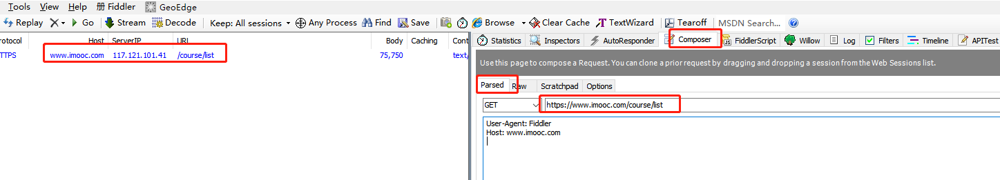

# 接口基础知识

## HTTP(Hypertext Transfer Protocol)超文本传输协议
    目前使用最广泛的是HTTP/1.1版本
    
    1. HTTP请求包含的内容 
    
       请求行 GET/index.html HTTP/1.1
       请求头 Host:www.example.com
          
             POST/HTTP/1.1
             Host: foo.com
             Content-Type: application/x-www-form-urlencoded
             Content-Length: 13
       空行      
             say-HI&TO=Mom
    
    
       消息体:不是所有的请求都有消息体的(PUT/POST都有)，一般GET请求是没有的，如果有消息体，与前面的内容一定存在空白行隔开请求头
       请求行和请求头在每个请求中都存在

    2. HTTP请求方法(CRUD-----POST、GET、PUT、DELETE)
    
       *GET    请求获取Request-URI所标识的资源(用于获取资源)
       *POST   在Request-URI所标识的资源后附加的新的数据(用于新建资源)
       *HEAD   请求获取由Request-URI所标识的资源的响应消息报头(用于检查资源)
       *PUT    请求服务器存储一个资源，并用Request-URI作为标识(更新资源)
       *DELETE 请求服务器删除Request-URI所标识的资源(用于删除资源)
       
    3. HTTP响应包含的内容
        状态行  HTTP/1.1 200 0K
        响应头  Date: Mon, 23 May 2005 22:38:34 GMT
               Content-Type: text/html; charset=UTF-8
               Content-Encoding: UTF-8
               Content-Length: 138
               Last-Modified: Wed, 08 Jan 2003 23:11:55 GMT
               Server: Apache/1.3.3.7 (Unix) (Red-Hat/Linux)
               ETag: "3f80f-1b6-3e1cb03b"
               Accept-Ranges: bytes
               Connection: close
        空行
        消息体 <!DOCTYPE html>
              <html lang="en">
              <head>
                <meta charset="UTF-8">
                <title>An Example Page</title>
                
              </head>
              <body>
                   This is a very simple HTML document.
              </body>
              </html>
              
    4. HTTP状态码
        2**  成功
        3**  重定向
            301：被请求的资源已永久移动到新位置
            302：要求客户端执行临时重定向（原始描述短语为“Moved Temporarily”）
            307：在这种情况下，请求应该与另一个URI重复，但后续的请求应仍使用原始的URI。 与302相反
        4**  客户端错误
            401：类似于403 Forbidden，401语义即“未认证”，即用户没有必要的凭据
            403：服务器已经理解请求，但是拒绝执行它。(没有权限)
            404：请求失败，请求所希望得到的资源未被在服务器上发现，但允许用户的后续请求   
        5**  服务器错误
            500：通用错误消息，服务器遇到了一个未曾预料的状况，导致了它无法完成对请求的处理。没有给出具体错误信息
            503：由于临时的服务器维护或者过载，服务器当前无法处理请求。这个状况是暂时的，并且将在一段时间以后恢复。
       
## Web接口测试方法
1. 使用第三方工具
    * 有很多支持web服务接口（主要是REST接口）测试工具：Postman、SoapUI、RestClient...
    * 核心功能
        构建HTTP请求消息
        解析收到的HTTP响应消息
        
2. 自己开发工具
    * 利用编程语言和一些库
    * 构造HTTP请求消息，并且解析收到的HTTP响应消息，检查结果
    * 这种方式更加适用于完全的自动化，并且和自动化框架结合起来使用
  
    
    总结：没有直接暴露到外部就不需要做接口测试（暴露给外部，一个系统调用另一个系统接口，给第三方使用的就需要进行接口测试）   
    
## REST(Representational state transfer)架构
    一：它定义了一种网络应用软件的架构风格特性
    二：具有这些风格特性的应用软件架构，可以称之为RESTful的软件架构
    三：REST并非设计规范，而是一种风格

    具体约束：
    *架构整体采用客户端和服务器结构
    *链接协议具有无状态型：确保系统的横向拓展能力
    *能够利用Cache机制增进性能
    *层次化的系统
  
## 1、消息交互接口、用户界面UI接口
    *diameter、radius -socket tcp
    *基于SOAP的 Web service -HTTP
    *REST API -HTTP
    
## 2、编程接口
    各种语言的开发包
    
## 3、其它接口
    数据服务产品，sql语言操作接口
    对账系统：FTP文件接口

    总结：所有和外界交互的部分都是接口，泛义上理解的话，所有的测试都可称之为接口测试
        UI测试是测试UI接口
        消息测试是测试消息接口
        编程库开发包测试是测试编程接口
        
## 4、Web服务接口
    互联网产品对外提供的服务接口，我们通常称之为
        *Web服务接口
        *web service 接口
        *Web API
    经常所说的"接口测试"、"API测试"、就是对Web服务接口的测试
        包括APP服务端接口
    
    主要包括两种类型
        *基于SOAP的Web Service接口
        *REST接口
        
## 5、基于SOAP的 Web Service接口
    (1)WSDL语言描述web service
    (2)用基于XML的SOAP协议来封装消息
    (3)用HTTP协议传输消息

    优点：清晰没有歧义，用软件工具可以定义出一个接口，甚至自动生成相应的代码
    缺点：比较复杂且消息体大，占用内存和带宽多。
    
## 使用fiddler测试接口
    fiddler右侧选项栏——Composer——Parsed——选择请求方法——输入URL回车——查看接口内容
    

 
    1、如何理解接口
    2、接口测试和功能测试的区别
    3、常见的接口类型有哪些
    4、接口是如何传递参数的（不同请求方法传递方式不一样例如get和post）
    5、如何测试一个接口（使用工具、自身编写脚本测试接口）