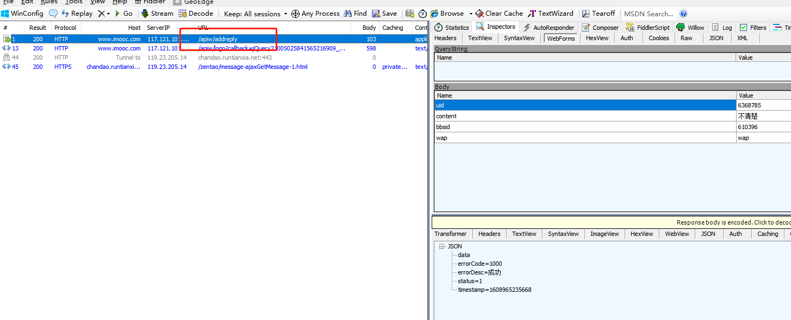
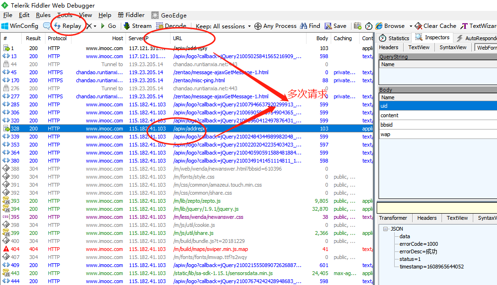
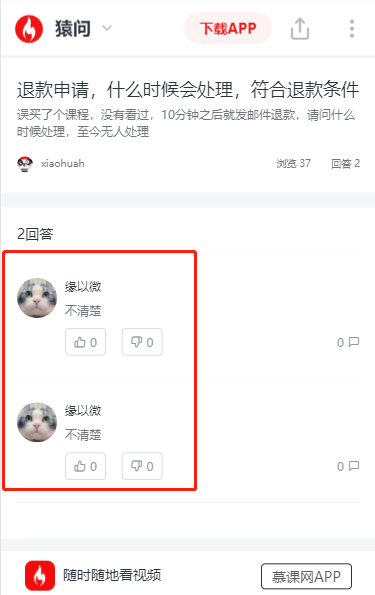

# fiddler使用
    参考链接转载自：https://blog.csdn.net/weixin_43664254/article/details/94601280
    
## fiddler大量重复数据模拟
    1. 访问imooc移动端——猿问——收入回答内容提交——抓取到接口：http://www.imooc.com/apiw/addreply
    

    2. 请求成功后，再次在fiddler选项栏多次点击”Replay"，就会请求多次

    3. 回到移动端页面刷新即可看到重复数据
    
    
 
 ## 模拟接口返回数据
    为什么要模拟数据
    * 解耦很重要
    * 并行开发很重要
    待完成
   