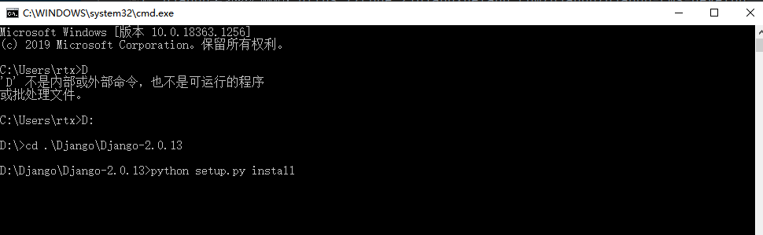
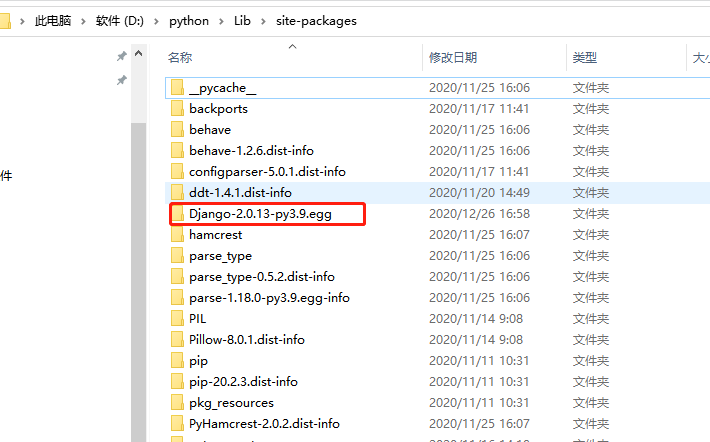
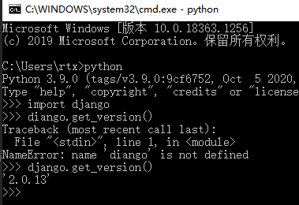

# Django环境搭建

1. django学习参考网站：https://www.runoob.com/django/django-install.html

2. 安装方法  
    * 第一种方法：pip install django
    * 第二种方法：pip setup.py install
    
3. 第二种方法的安装步骤
    > 步骤一：访问Django官网下载压缩包（1.6以上版本完全兼容Python3.*） https://www.djangoproject.com/download/  
      步骤二：解压Django压缩包，并且和Python安装目录放在**同一个根目录**  
      步骤三：cmd命令窗口进入Django目录，执行命令 python setup.py install 
      步骤四：Django最后安装在python的Lib下site-packages目录中
      步骤五：将D:\python\Lib\site-packages\Django-2.0.13-py3.9.egg配置到系统环境变量中
      步骤六：cmd命令窗口检测是否安装成功
              

                 