# Django环境搭建

1. django学习参考网站：
    * https://www.runoob.com/django/django-install.html
    * https://www.liujiangblog.com/course/django/85
    
2. 安装方法  
    * 第一种方法：pip install django
    * 第二种方法：pip setup.py install
    
3. 第二种方法的安装步骤


      步骤一：访问Django官网下载压缩包（1.6以上版本完全兼容Python3.*） https://www.djangoproject.com/download/  
      步骤二：解压Django压缩包，并且和Python安装目录放在**同一个根目录**  
      步骤三：cmd命令窗口进入Django目录，执行命令 python setup.py install 
      步骤四：Django最后安装在python的Lib下site-packages目录中
      步骤五：将D:\python\Lib\site-packages\Django-2.0.13-py3.9.egg\Django\bin配置到系统环境变量中
      步骤六：cmd命令窗口检测是否安装成功
             
              
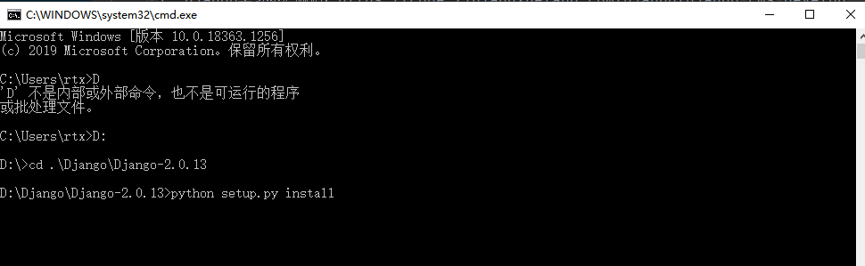


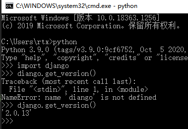

## 创建项目

1. windows的cmd命令窗口创建django项目  
    * 执行命令django-admin startproject + 项目名称
    * 如下创建的名称为RTX的项目，其中RTX为根目录
    * 根目录RTX下存在同名的RTX目录，这是整个项目的配置文件目录（不可和根目录混淆）
    * 还有一个manage.py文件是整个项目的管理脚本
    
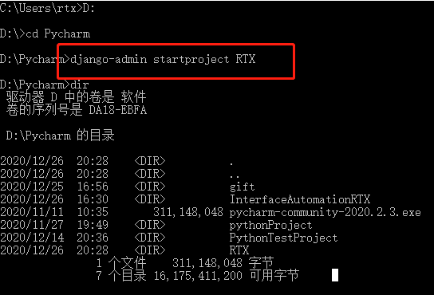

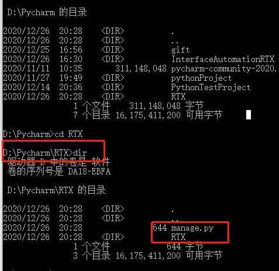

## 启动django
    * cmd命令窗口回到根目录RTX下，执行python manage.py runserver命令
    * Django会以127.0.0.1:8000默认配置启动开发服务器
    * 打开浏览器访问127.0.0.2:8000,出现以下页面则启动成功
       
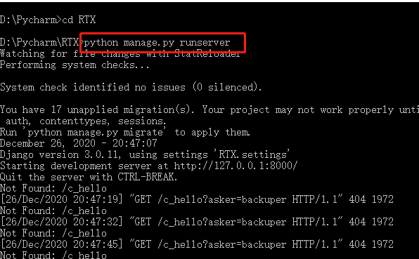

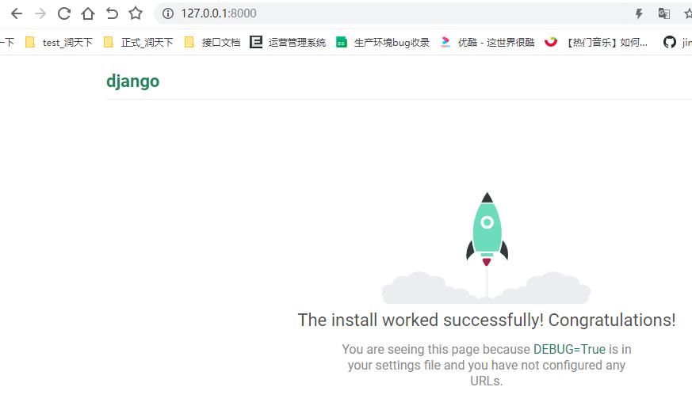
    
    注意：启动项目时8000端口被占用，命令窗口提示:Not Found: /c_hello,可将占用该端口进程kill,命令如下
    查看指定端口被占用情况：netstat -aon | findstr 8000
    查看对应PID进程情况：tasklist|findstr "43084"
    终止该进程：taskkill /f /t /im CLodopPrint32.exe
    
    参考链接：https://www.cnblogs.com/hghua/p/13277720.html
    
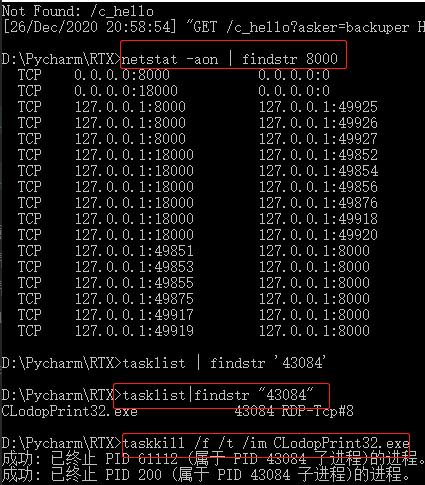

## 创建app应用
    1. 根目录下执行：python manage.py startapp + app名称

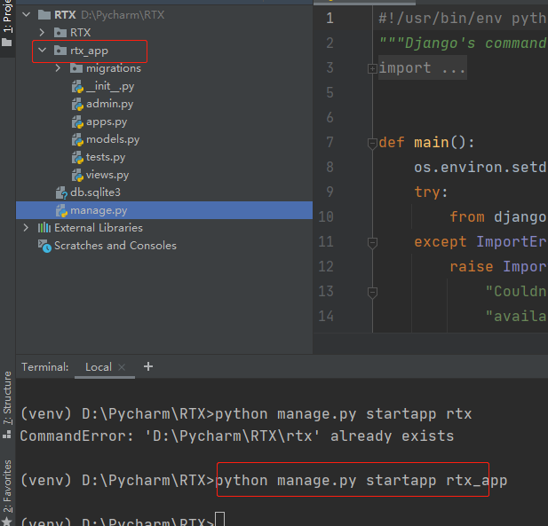      

    2. 添加app应用程序添加到settings.py文件中的INSTALLED_APPS列表中
    
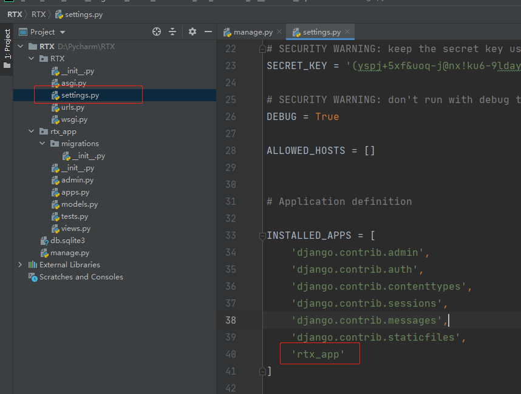

    3. views.py文件中编写视图
```python 
# coding:utf-8
from django.http.response import HttpResponse


def login(request):
    return HttpResponse('index')
```
    
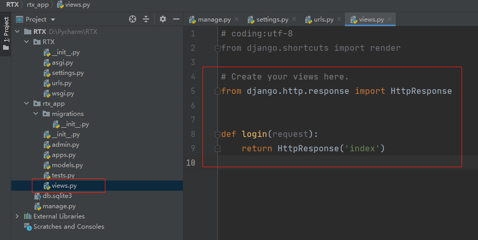

    4. urls.py路由配置文件中加入路由，将其映射到上面新增的视图
    
```python 
from django.contrib import admin
from django.urls import path
from rtx_app.views import login

urlpatterns = [
    path('admin/', admin.site.urls),
    path('login/', login)
]
```

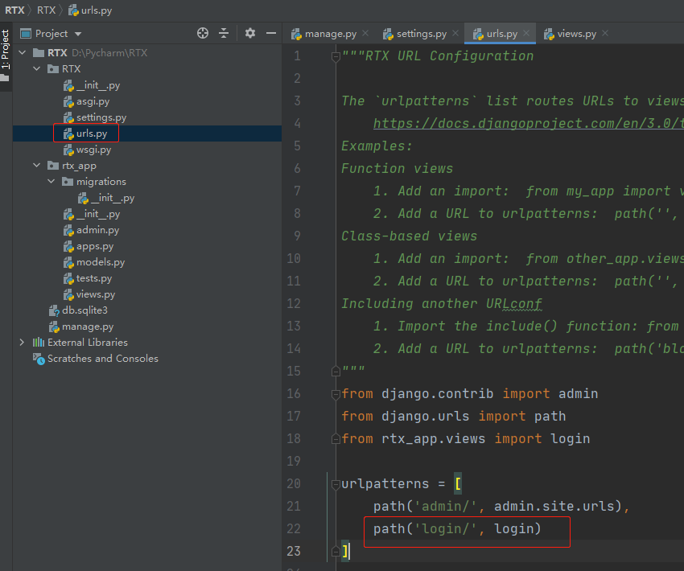

    5. 浏览器访问127.0.0.1.8000/login/
    
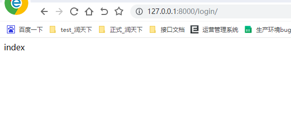

  
          
