### 学习目标

    1、正确理解性能测试与典型软件体系架构
    2、掌握性能测试规范化流程与方法
    3、能根据不同的需求规划性能测试
    4、传统与敏捷环境下开展性能工作
    
### 软件八大质量特性

    * 功能、性能、安全、可靠、可用、易用、交互、可变
    
### 性能测试

    * 属于软件测试的范畴，旨在测试处于特定环境和配置下的系统，在一定量的负荷下，系统的正确性
      响应时间、速度TPS、成功率、稳定性、可恢复性等特性是否满足特定干系人需求的能力。系统性
      能关乎用户的体验，性能属于产品的非功能质量特征
      
    * 不符合需求情况下：结合系统的业务模型、环境配置、设计、实现细节等识别出问题，并确保该问
      题妥善解决的过程
      
      
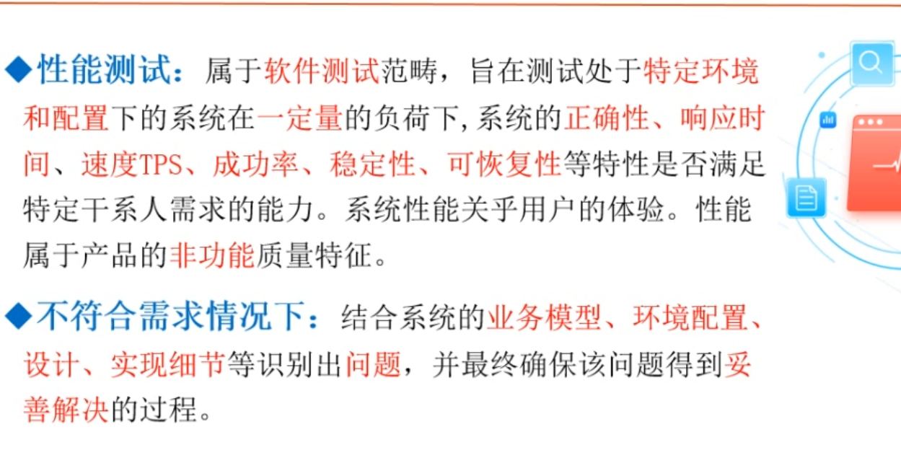

### 性能测试误区与理解

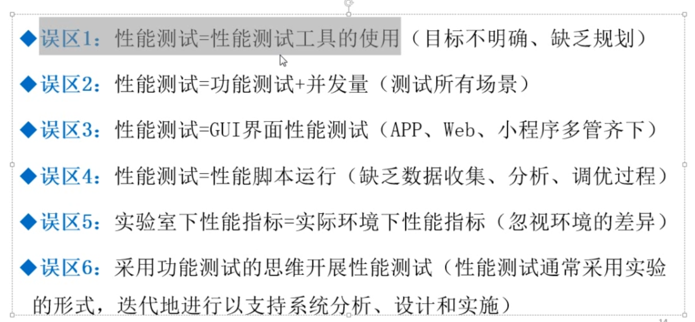    

    * 主要核心是通过模拟不同协议用工具去访问服务器端接口性能测试（App、Web、小程序只是展现方式）、前端页面的性能测试较少
      总结：1、服务器对外提供什么协议；2、用什么工具可以模拟这个协议；3、熟练使用工具（三板斧）
     
    * 例如公司里的网站和数据库连在同一个交换机上的，他们的网络带宽、延迟基本上可以忽略不计，实际情况数据库和web服务器是跨
      区域的所以存在网络带宽和延迟，实验室下数据库数据可能就几百条，实际可能是几千、几万的数据（尽可能对标环境）
      
    * 功能测试一条登录用例可能测试一遍通过即可，但是性能上可能需要跑多次，因为可能硬件不同、环境不同、配置不同，比如调整了
      JAVA虚拟机内存，那就需要重新再跑
      
### 什么时候需要做性能测试

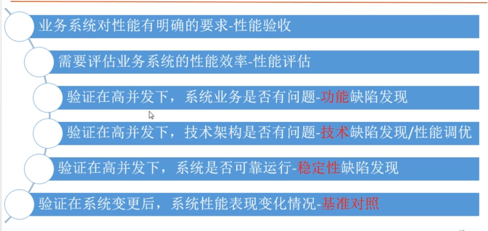   

    * 第一点：甲方给乙方有明确要求验收标准，其中要求每秒钟支持多少人登录并且响应时间小于多少秒，这就需要性能测试
    * 第二点：公司需要投标没有什么验收标准，其他厂商都宣称最低配置达到最高业务支持力度，跑主要流程进行性能评估，
      做到对自己的系统有一定了解，防止说突然发生性能瓶颈问题，到时线上同时分析解决
    * 第三点：功能测试发现很多问题，但有些问题没有大量访问是不会出现的，每秒5000并发，跑了第六个小时突然失败了
      几百个消息超时，然后又正常，后面发现JAVA系统做了垃圾回收机制把当前业务中断了
    * 第四点：数据库只有一台，读写全在一个库里，高并发下很容易成为性能瓶颈，可以一个专门写，一个专门读（架构问题）
    
    注意：tps和qps区别
        * tps是一个事务：比如银行取钱动作包括：查询金额、扣除金额、写入最终金额等
        * qps则是每个查询的动作都算一次，比如查询金额算一次，扣除金额算一次
        
### 能力验证

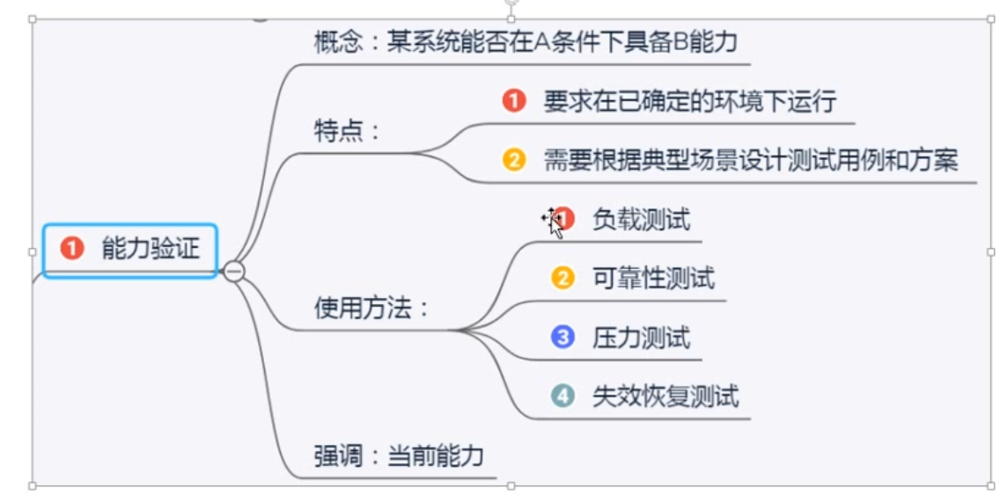   

### 验收性——示例

    指标明确，最好测试
    
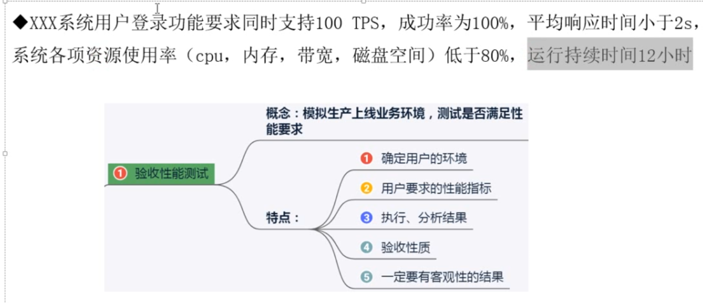   

### 性能评估（能力规划）
    
    没有指标的情况下，自己制定指标然后慢慢优化（制定基线指标）
    
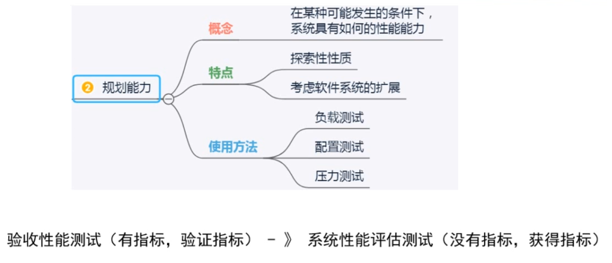   

### 高并发下的业务缺陷发现

    * 系统失效可能有的项目会保障前面的消息，后面的全部不处理，有的项目可能是进来的处理，旧数据则不处理扔掉
      例如早期12306购票系统：当很多人去购票时，可能自己就会被挤掉

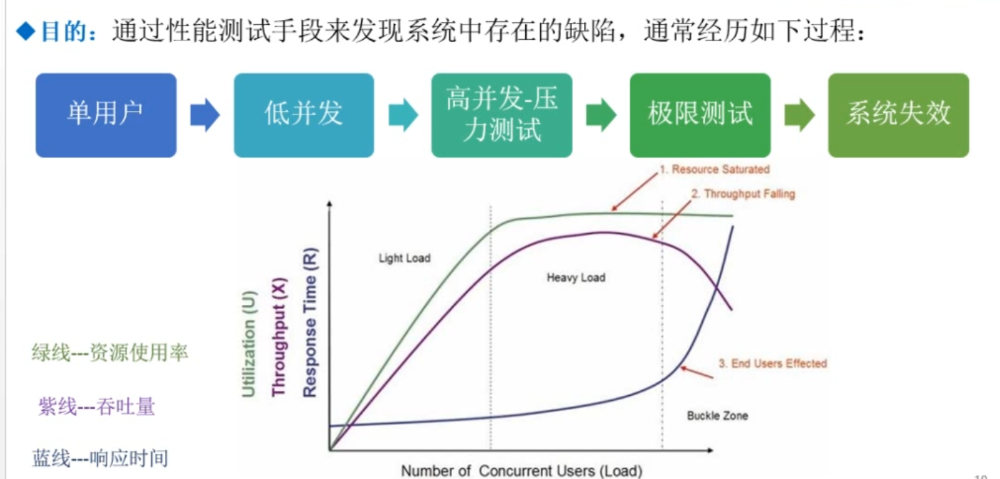   

### 性能分析与调优

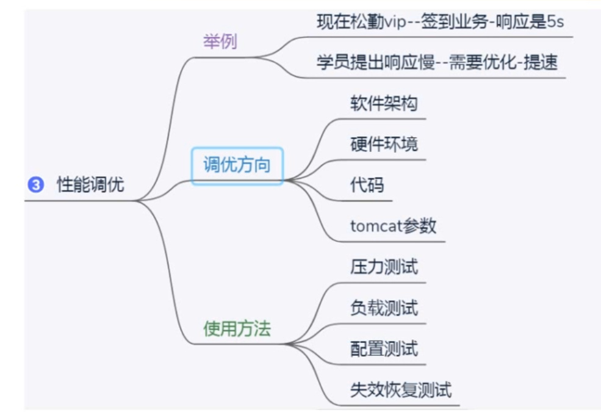   

### 稳定性（时间+负载）测试

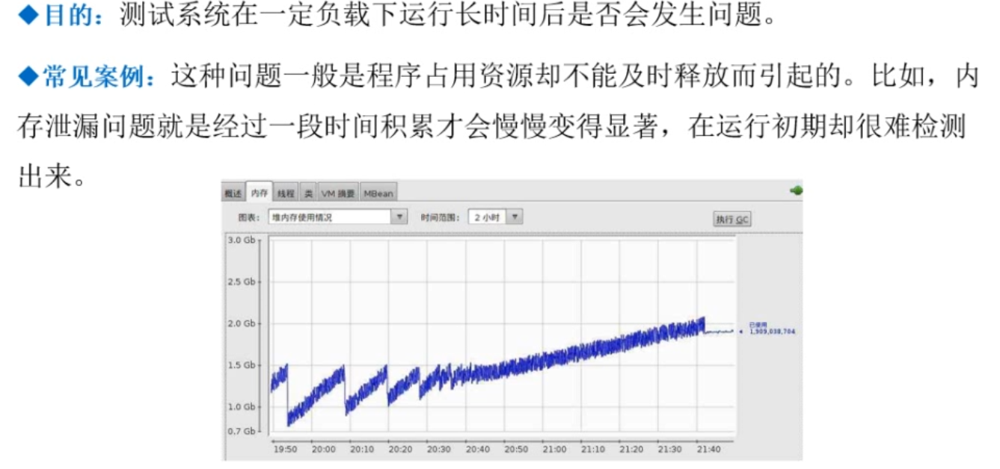
    
    内存泄露（借了不还）：任何操作系统运行都需要资源包括cpu给的运行时间，运行时数据要从磁盘调到内存中这是内存空间给的
    只有时间和空间才可以运行程序（先调用内存再调用CPU缓存再进行cpu时间运算，然后cpu需要什么从缓存里调用，缓存又从内存
    里调用，内存又从磁盘里调用），很不巧程序运行的时候占了cpu时间又用了内存空间，用了内存空间未释放（比如借书，借了图书
    馆所有的书，导致其他人无法借书，图书馆就倒闭了相当于系统宕机了）
    
    JAVA有回收机制，C与C++是没有回收的，需要程序员写函数回收，内存泄露一点是无所谓的，就像只借出一两本书一样，所以需要
    长时间的负载测试才能看出有没有长期大量泄露，现在JAVA很多使用的包底层就是C写的
    
### 变更环境下的性能测试——基准对照

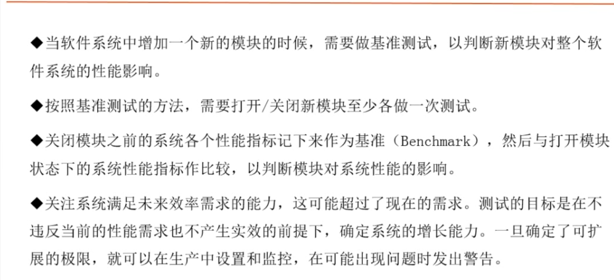

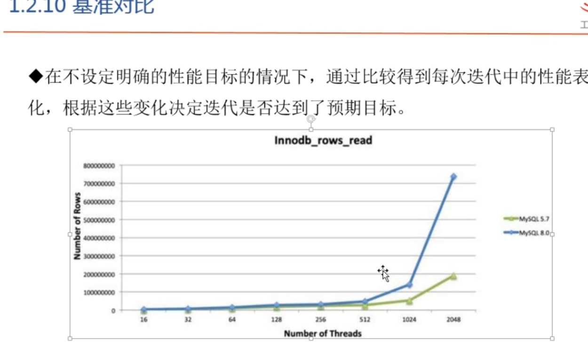

### 性能测试中用到的测试技术（类型）

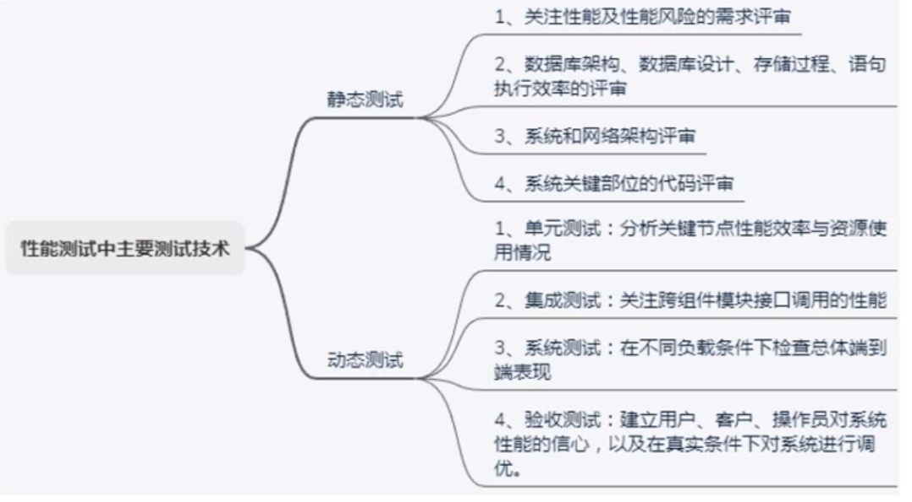

### 性能测试——负载生成的方法

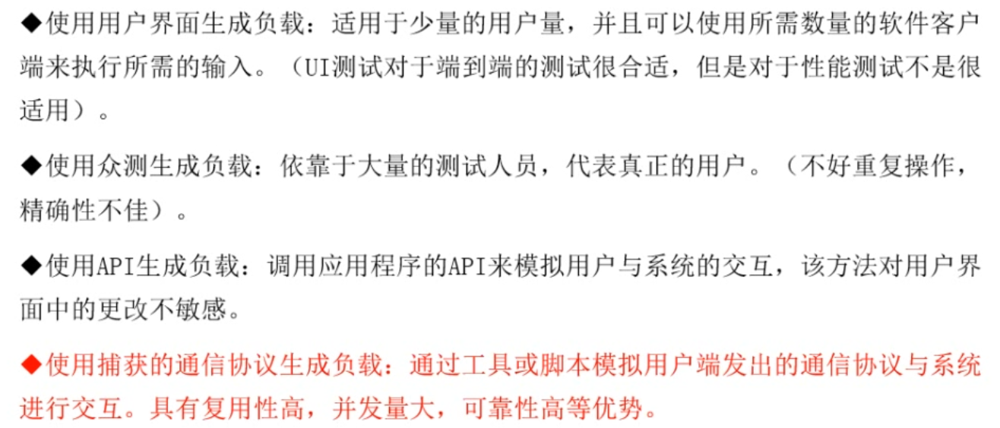

### 方法论PDCA——戴明环

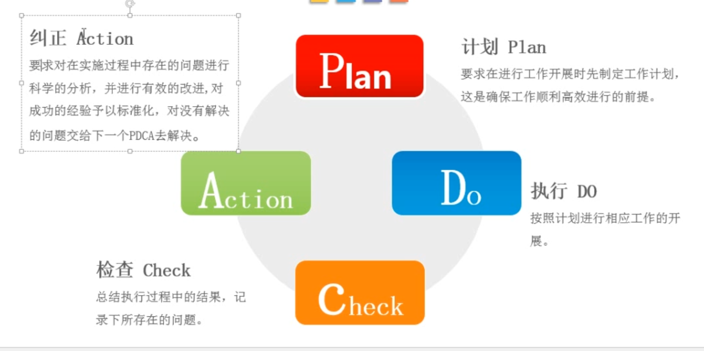

    书籍：ISTQB认证测试工程师基础级大纲、ISTQB软件测试人员认证基础级大纲性能测试、性能之巅
    
### 性能测试规划

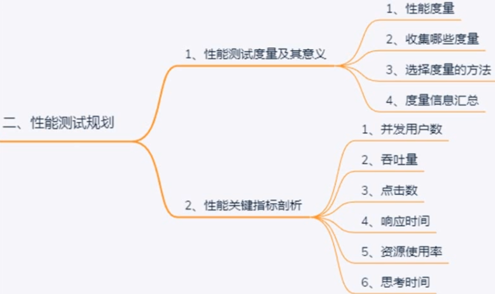

    1、性能度量
       * 如果没有事先了解需要测量哪些指标，就不应该进行性能测试
       
    2、收集哪些度量（选择度量的决定因素） 
    
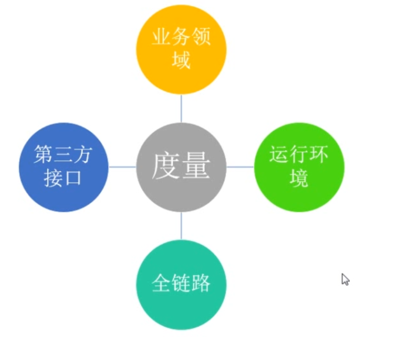

    3、选择度量的方法——GQM
    
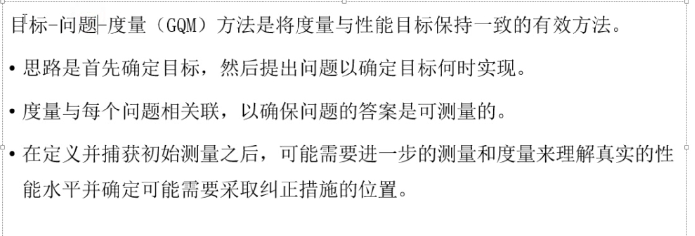
    
        

    