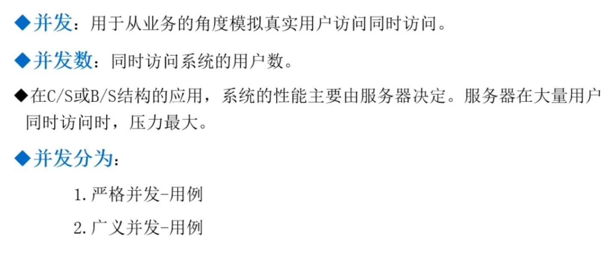
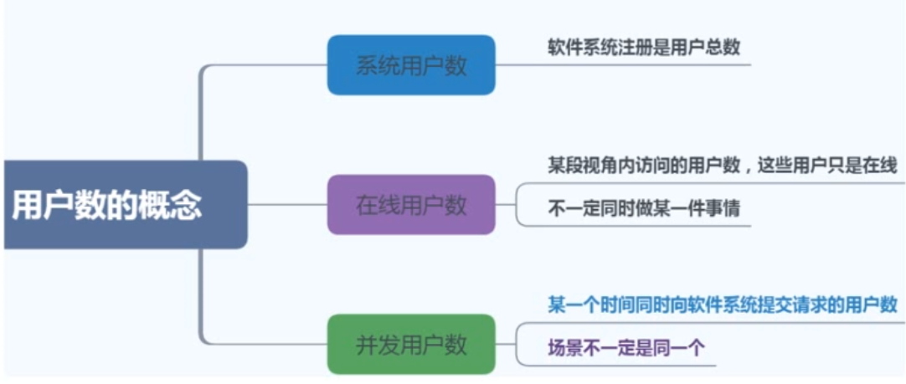
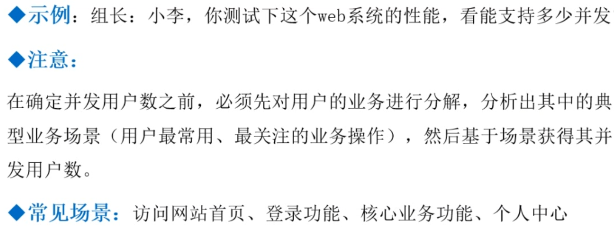
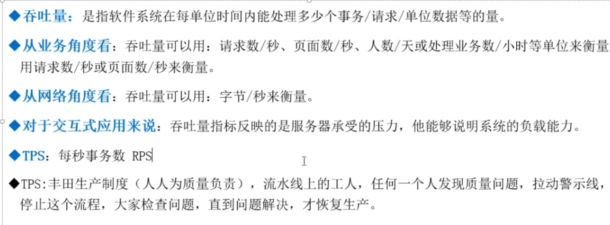
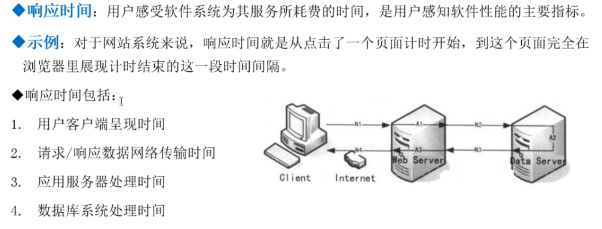
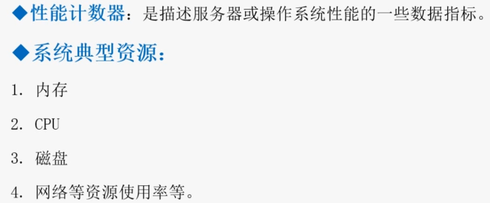
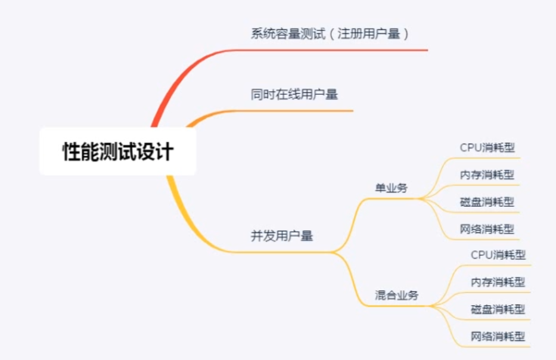
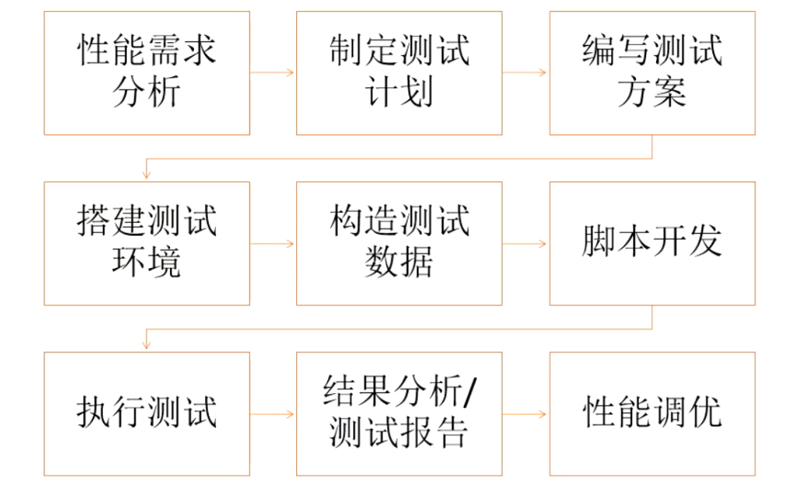

### 学习目标

    1、正确理解性能测试与典型软件体系架构
    2、掌握性能测试规范化流程与方法
    3、能根据不同的需求规划性能测试
    4、传统与敏捷环境下开展性能工作
    
### 软件八大质量特性

    * 功能、性能、安全、可靠、可用、易用、交互、可变
    
### 性能测试

    * 属于软件测试的范畴，旨在测试处于特定环境和配置下的系统，在一定量的负荷下，系统的正确性
      响应时间、速度TPS、成功率、稳定性、可恢复性等特性是否满足特定干系人需求的能力。系统性
      能关乎用户的体验，性能属于产品的非功能质量特征
      
    * 不符合需求情况下：结合系统的业务模型、环境配置、设计、实现细节等识别出问题，并确保该问
      题妥善解决的过程
      
      

### 性能测试误区与理解

    

    * 主要核心是通过模拟不同协议用工具去访问服务器端接口性能测试（App、Web、小程序只是展现方式）、前端页面的性能测试较少
      总结：1、服务器对外提供什么协议；2、用什么工具可以模拟这个协议；3、熟练使用工具（三板斧）
     
    * 例如公司里的网站和数据库连在同一个交换机上的，他们的网络带宽、延迟基本上可以忽略不计，实际情况数据库和web服务器是跨
      区域的所以存在网络带宽和延迟，实验室下数据库数据可能就几百条，实际可能是几千、几万的数据（尽可能对标环境）
      
    * 功能测试一条登录用例可能测试一遍通过即可，但是性能上可能需要跑多次，因为可能硬件不同、环境不同、配置不同，比如调整了
      JAVA虚拟机内存，那就需要重新再跑
      
### 什么时候需要做性能测试

   

    * 第一点：甲方给乙方有明确要求验收标准，其中要求每秒钟支持多少人登录并且响应时间小于多少秒，这就需要性能测试
    * 第二点：公司需要投标没有什么验收标准，其他厂商都宣称最低配置达到最高业务支持力度，跑主要流程进行性能评估，
      做到对自己的系统有一定了解，防止说突然发生性能瓶颈问题，到时线上同时分析解决
    * 第三点：功能测试发现很多问题，但有些问题没有大量访问是不会出现的，每秒5000并发，跑了第六个小时突然失败了
      几百个消息超时，然后又正常，后面发现JAVA系统做了垃圾回收机制把当前业务中断了
    * 第四点：数据库只有一台，读写全在一个库里，高并发下很容易成为性能瓶颈，可以一个专门写，一个专门读（架构问题）
    
    注意：tps和qps区别
        * tps是一个事务：比如银行取钱动作包括：查询金额、扣除金额、写入最终金额等
        * qps则是每个查询的动作都算一次，比如查询金额算一次，扣除金额算一次
        
### 能力验证

   

### 验收性——示例

    指标明确，最好测试
    
   

### 性能评估（能力规划）
    
    没有指标的情况下，自己制定指标然后慢慢优化（制定基线指标）
    
   

### 高并发下的业务缺陷发现

    * 系统失效可能有的项目会保障前面的消息，后面的全部不处理，有的项目可能是进来的处理，旧数据则不处理扔掉
      例如早期12306购票系统：当很多人去购票时，可能自己就会被挤掉

   

### 性能分析与调优

   

### 稳定性（时间+负载）测试

    
    内存泄露（借了不还）：任何操作系统运行都需要资源包括cpu给的运行时间，运行时数据要从磁盘调到内存中这是内存空间给的
    只有时间和空间才可以运行程序（先调用内存再调用CPU缓存再进行cpu时间运算，然后cpu需要什么从缓存里调用，缓存又从内存
    里调用，内存又从磁盘里调用），很不巧程序运行的时候占了cpu时间又用了内存空间，用了内存空间未释放（比如借书，借了图书
    馆所有的书，导致其他人无法借书，图书馆就倒闭了相当于系统宕机了）
    
    JAVA有回收机制，C与C++是没有回收的，需要程序员写函数回收，内存泄露一点是无所谓的，就像只借出一两本书一样，所以需要
    长时间的负载测试才能看出有没有长期大量泄露，现在JAVA很多使用的包底层就是C写的
    
### 变更环境下的性能测试——基准对照

### 性能测试中用到的测试技术（类型）

### 性能测试——负载生成的方法

### 方法论PDCA——戴明环

    书籍：ISTQB认证测试工程师基础级大纲、ISTQB软件测试人员认证基础级大纲性能测试、性能之巅
    
### 性能测试规划

    1、性能度量
       * 如果没有事先了解需要测量哪些指标，就不应该进行性能测试
       
    2、收集哪些度量（选择度量的决定因素） 
    

    3、选择度量的方法——GQM
    

    
    4、度量信息来源
        * 负载工具
        * 监控工具
        * 日志文件
        * 告警信息
        
### 并发用户数（Concurrent users）

    * 单核（运算器）cpu是不存在并发的，每个时间节点就处理一个程序
    拿到性能需求先性能分析：
        先一分为二（哪些是单业务，哪些是混合业务）则可以得出下面两类用例
        * 严格并发——用例——秒杀（所有的访问量同一个时刻做同一件事）
        * 广义并发——用例——登录、查询、购买、支付等综合场景（大量用户访问网站，但是用户操作的场景不一样）
        
    * 并发用户数类型划分
    
    

        系统用户数：指的是数据库里注册的用户数
            * 系统宣称支持一亿用户量，则需要进行容量测试进行判断（这些都是基于模型测试的，比如用户有头像的，部分有下单的等）
            * 系统用户不断的注册会对文件系统产生压力（即磁盘，储存空间）——》产生用例——》系统容量测试（注册用户量）
            
        在线用户数：判断一个系统的活跃度用这个衡量，但在线用户数有的只是浏览这个并不产生负荷，所以有一大部分没有产生访问量
            * 此用户跟内存有关（session）——》产生用例——》支持的同时在线用户数
            * 例如不断的登录，看前面的用户会不会受营销掉线，后面的用户能不能正常登录，最后会触发内存机制要么内存不够，要么塞满宕机）
            
        并发用户数：一直在操作的用户
            * 产生两种场景用例：单场景和多场景
            
        总结：三者都会对服务器造成负载压力
            基本所有系统都需要考虑的用例：1、系统容量测试；2、支持同时在线用户数；3、单场景；4、多场景
            
    * 并发用户数与业务场景
    
 

    * 并发用户数计算不推荐使用
        这是针对网站具有参考性，要根据实际用户去统计、建模调整才有意义，因为用户群体、公司不一样模型不一样
        
### 吞吐量（throughput）

 
    
    * 吞吐量：就是一个漏斗，上面挂满了东西然后单位时间内落下去的量
      每单位时间：这个单位时间可以是一秒钟、一分钟、一天等，所以吞吐量往往不是用来衡量性能的指标，所以
      会有一个值叫吞吐率
      
    * 吞吐率：按秒为单位进行计算，就是每秒钟你的系统可以处理多少请求，每秒钟可以处理多少数据等，但同样
      并不精准，因为对数据的概念不清楚，有包括消息、响应等无法区分，更精准的是使用TPS和QPS
      
    * TPS：每秒钟所处理的事务量（事务具有原子性：要么完成，要么失败，就像银行取钱要么成功取到，要么没
      取到，不存在说钱减少了但实际没取到的情况）
      注册功能：首先用户点击注册提交信息，信息首先发到注册服务系统，服务器收到消息并不是立马注册，跟另
      外的系统有对接，先在另外的系统进行查询有没有注册，已注册且信息可以共享的，则可以直接调用，这个功
      能不是一个消息，而是两条消息，先到A系统，A系统到B系统先查询，如果成功时两条消息都成功，否则失败
      
      工作中需要抓包确定操作某个步骤是发了几条消息完成了一个事务，例如点击按钮到响应可能就会生成多条消息
      构成一个TPS，但是有多个RPS(一般都是统计端到端的TPS)
      
### 响应时间（Response time）

 

    * Client客户端发送一个请求的响应时间是5s，是不是就很慢呢，需要先了解这5秒的构成，然后分析是在哪里浪费的
        1、首先测试机器发送请求到公司机房服务器上，这个时间可以在Jmeter上使用ping命令，Ping下服务器查看需要多少毫秒例如10ms
        2、然后5000ms-20ms就是后面响应的时间（如果说ping的时间远不止10ms，说明测试机与服务器网络出现问题，这就不是开发的事了需要找运维）
        3、如果上面时间没问题，就需要咨询开发系统部署有哪些环境，数据库和web服务器在不在一起（数据库存在拓扑结构即系统部署图）web服务器
           在哪里需要登陆上去，现在用户登录、用户注册是不是要到后台服务器查询，那你数据库服务器告诉我，登录了web和数据库服务器ping一下
           查看它们的时间消耗了1s(多ping几次，比如20次求个平均值)
        4、如果最后算出5s-3s-1s=1s是数据查询时间、web应用时间以及终端显示时间
        5、分析这上面得出的1s，可以让开发干掉数据库服务器，用模拟器代替隔离数据库影响，最后查看web服务器响应消耗时间，如果隔离后模拟器与
           真实数据库响应时间差不多，说明就是web服务器太慢了，所以最后需要监控
           
### 资源使用率（Resource utilization）

 

### 思考时间（Think Time）

    注意：思考时间不是一个指标
    
     

    思考：项目的CPU消耗型、内存消耗型、磁盘消耗型、网络带宽消耗型
    
    总结
    
  
        

    
        

    