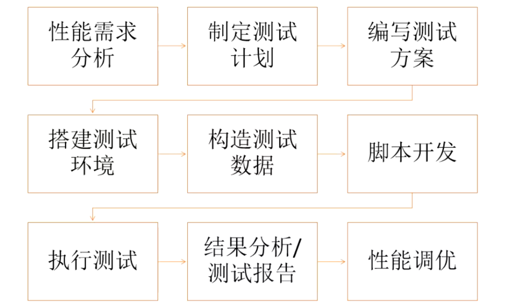

### 性能测试流程

    
    1、性能需求分析：确实是验收或性能评估或缺陷发现，就主要分为这三种
    2、制定测试计划：目标、测试范围、开始和结束条件、人力资源、时间、工具等
    3、编写测试方案：更具体的实施步骤，类似于测试用例
    4、搭建测试环境：
    5、构造测试数据：制造更贴近实际情况，符合业务场景数据
    6、脚本开发：可以跟构造数据互换
    7、执行测试——》结果分析/测试报告——》性能调优
    
### 测试准备

    * 充分理解系统业务：关键功能场景手工跑一遍
    * 充分理解系统环境：测试环境自己搭建一遍
    * 充分理解通讯协议：自己抓包复现一遍，fiddler/Wireshark/tcpdump（每个场景抓包都要记录）
    * 40000万 TPS
    * 16台服务器，Seagull 12个工具
    
### 性能风险管理（需求分析就需要考虑）

    对于产品性能相关风险，流程为：
        * 识别产品质量风险，专注于时间特征、资源使用及容量等特征
        * 评估已经识别的风险，确保相关的体系结构类别重视起来，使用已经明确定义的标准
          逐一评估已经识别的风险其可能性、严重程度和风险级别
        * 针对每项风险的本质和风险级别，采取恰当的风险缓解措施
        * 持续管理风险，确保风险在发布前得到充分的缓解
        
### 测试计划

    确定性能测试目标：
        验收、评估、缺陷复现、瓶颈分析等
        
    规划测试资源：
        时间、人员、硬件、软件、配置、工具、培训等
        
### 测试分析与设计

    典型的功能场景：性能场景的切换
    性能测试场景脚本化
    松勤网登陆功能——》多用户并发登陆（探索）
    录播：多人同时看视频：快进
    
### 测试场景设计

    考虑：1、业务场景；2、单场景；3、混合场景
    关键性能测试场景设计：
        * 确定哪些业务放到一起测试，各个业务的交易占比是多少。场景是从生产业务模型转化而来的
          按照业务模型来设计测试场景，可以保证测试模拟更贴近生产实际的交易场景
          
    典型的场景有：
        * 正常交易日业务模型
        * 峰值交易日业务模型
        * 特殊交易日业务模型等
        
    示例：
        单场景：
            1、注册，每秒钟100人注册——对应JmeterAJ脚本
            2、登录，每秒钟1000人登录——JmeterB脚本
            3、签到：每秒钟10人签到——JmeterC脚本
           
        混合场景：
            1秒钟里面：
                注册有10人，登录有100人，签到50人
        就是将上面单场景的分别设置线程数，然后同时执行
        
### 测试实施

    * 性能测试环境搭建
    * 如何缩小测试环境与生产环境的差别
        1、网络延迟的注入
            支付宝支付：A（Web服务器）发到B（模拟支付的模拟器）是0.1s，这种测试是无效的因为都在同一个机房里速度快
            真实情况是需要1s-3s，所以需要考虑使用第三方网络延迟的情况，这种延迟会造成资源的堆积，就要注入延迟时间
            
            先cmd命令窗口ping一下支付宝时间，来确定需要延迟多久：ping aliyun.com
            然后在网站查询解决延迟方法，让IT往你需要的两个设备之间注入这个延时时间
            
            总结：就是发出请求，然后支付宝停顿一下再返回，让自身产生堆积
            
        2、现场数据的插入
            本身真实系统已经存在100万数据，但是刚搭建的性能测试环境数据是0，造成误差没有参考性
            所以需要先将数据脱敏过滤，把整个数据库搞过来；现场数据不让导出，那就用脚本不断模拟真实数据结构造大量数据
            
        3、性能监控工具开销的剔除
            监控服务器性能指标时会发现监控工具也运行在上面
            需要在系统软件没有运行时，运行起监控工具看占用CPU、内存多少，测试完再剔除
            
### 环境部署

    目前企业主流的性能环境部署主要分为以下三类
        * 高性能服务器——独占式 （都安装在一个服务器上）
        * 高性能服务器——虚拟机技术
        * 高性能服务器——容器+微服务部署
        
### 测试环境如何接近生产环境
    建议：
    * 将集群环境改成单台服务器，将有限的资源集中供应某一台服务器
    * 去掉中间环节的服务器，直接压测核心系统
    * 通过在局域网主机里面插入网络延迟来模拟广域网的行为
    
### 测试执行

    * 性能测试工具配置与运行
    * 性能监控工具与执行
    * 测试环境独占性（重要）
        测试过程中不可关掉电脑，占用几天
        
### 测试结束与报告

    * 测试结果分析
    * 缺陷报告
    * 测试结果图形化报告
    
### 敏捷体系
    
    * 敏捷方法
    * 敏捷12原则
    * 敏捷4大宣言
    * 敏捷联盟（社区）
    
    实施过程
    
    

   

### 敏捷环境下的性能测试的特点
    
    在敏捷环境下，性能测试是迭代和增量的活动，可以作为迭代的一部分进行
    也可以作为一个完全用于性能测试的迭代进行
    
    性能测试可以是持续集成（CI)中执行自动化测试的一部分
    
    

### 商城项目

    性能测试三步走：
    1、确定范围：确定分析需要性能测试的大范围：主要测试买家端
    2、提取性能相关的瓶颈点（业务点）
    3、设计脚本
    
    性能测试开发三步走：
    1、手工跑业务+抓包
    2、通过工具Jmeter重现消息
    3、消息参数化
    
    性能监控三步走：
    1、确定要监控什么（web服务器、数据库服务器、CPU、内存、日志、磁盘空间）
    2、找到合适的监控工具（TOP、vmstat、集成工具）
    3、收集数据
    
### 性能测试开始之前

    1、先阅读都市商城项目（买家功能说明书）PDF文档
    2、阅读商城项目的技术方案文档
    3、编写测试计划
    
    

           