### 软件体系架构概述

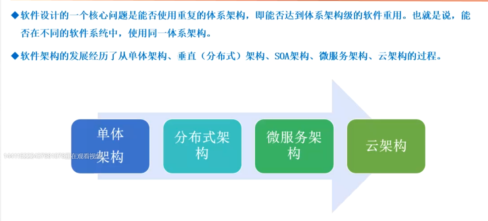

    * 单体架构：一台服务器带一个数据，前端访问，用户量过多存在性能问题

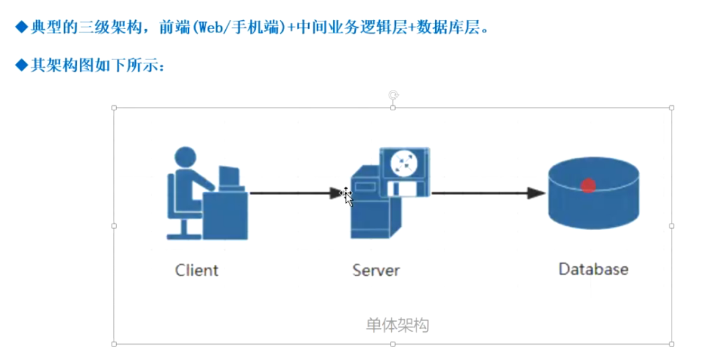

    * 分布式（垂直）架构：就是添加一个负载均衡器
    
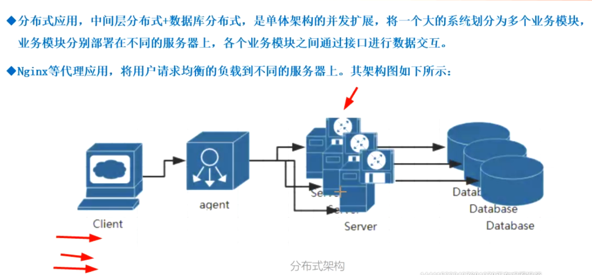

    * 微服务架构：就是加装docker容器虚拟环境
    
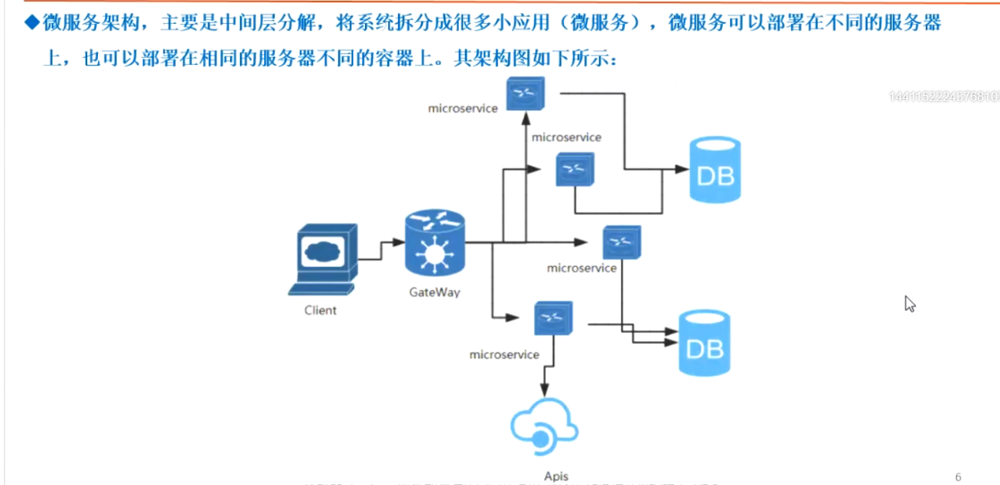

        微服务架构流程图：微服务是为了充分利用每一台机器的资源，分布式主要是把不同的业务部署到不同的服务器
        
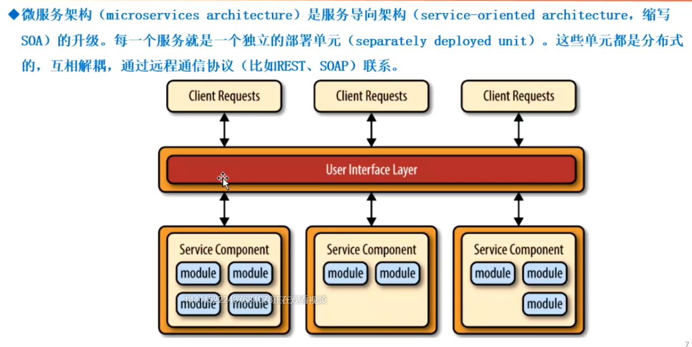     

    * 云架构（无服务架构）：发展中，就是从网上购买不同的接口获取数据，从而显示在屏幕中
      例如需要每天的天气信息，只需要跟气象台购买接口权限然后就可以获取实时刷新的数据了
    
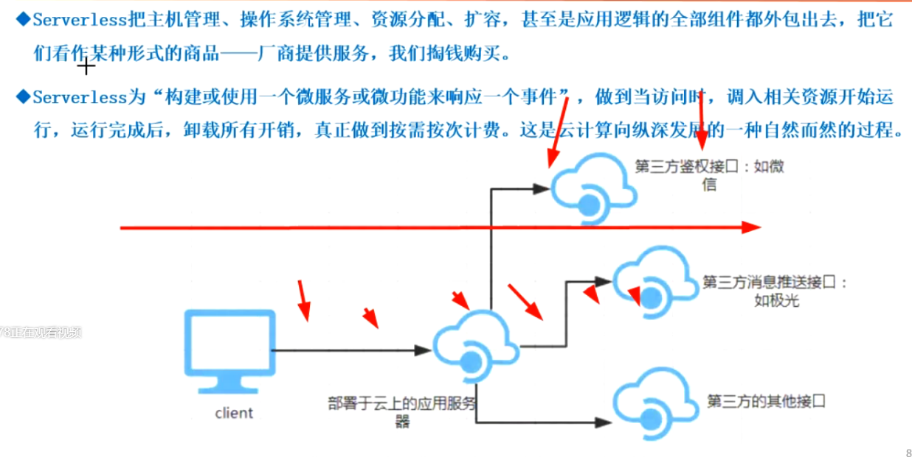  

    注意：响应时间包括：网络传输时间+服务器处理时间+客户端加载时间
    判断：测试发现系统CPU系统使用率很高，因此断定系统是CPU瓶颈所在，并建议公司为系统配备更加强劲的CPU。
         这是错误的，原因很多一方面可能是CPU运行的非常快速，很多任务在不断的切换所以他使用率很高，另外可能CPU任务不多，但
         有些等待的时间内存响应，等待网络数据传输也会造成CPU上升，应该分析CPU资源是花在处理业务上面还在花在其他地方，可以
         使用top命令，监控查看cpu是否存在wait时间，存在的话，看是不是机械硬盘，可以换成固态；或者数据分区，可以系统启动
         时加大内存空间，让磁盘的数据全部读到内存中，用内存空间换取硬盘访问速度慢的开销问题
         
    属于CPU消耗型的场景：包含大量运算的，比如系统实时计算股票交易数据；10万用户同时登陆系统
    属于磁盘消耗型的场景：从100万条数据中查询小张的订单数据，因为需要索引检索，在机械硬盘中要导到磁盘I/O具体分区把它读取出来，固态硬盘可能快一些
    属于网络资源消耗型场景：系统通过接口查询一个位于国外运营商系统中的用户数据
    属于内存消耗型场景：（大量数据存放并且要用到或者为了提高磁盘的速度，把磁盘的数据导到内存中，一般使用在缓存技术中）系统使用了memcached作为缓存容器
    
    如果一个应用程序存在内存泄露，性能测试最可能看到的结果：响应时间随着时间推移变慢
    
    哪些阶段可以开展性能测试
        * 单元测试阶段：对关键代码开展性能测试
        * 集成测试阶段：对模块之间的接口开展性能测试
        * 系统测试阶段：对关键业务开展系统级别的性能测试
        
    性能测试产生负载的方法
        * 使用用户界面生成负载
        * 使用众测生成负载
        * 使用API生成负载
        * 使用捕获的通信协议生成负载
        
    对于一个大型的电商系统开展性能测试，分析认为可能存在哪些性能瓶颈点
        * 双十一秒送（属于高并发的场景需要设计用例）
        * 晚上0点，后台定时作业执行对系统的影响（定时作业执行，可能对系统性能产生影响）
        * 用户通过手机号注册，收到短信验证码的速度（虽然很多时候使用第三方平台，但是第三方平台性能不行，将影响系统注册）
        
    搭建性能测试环境需要考虑的因素
        * 硬件配置、软件配置、网络延迟、性能监控工具开销排除等是否与实际应用一致
        

### 全链路压测技术

    案例
    
  

    概念：基于实际的生产业务场景、系统环境、模拟海量的用户请求和数据对整个业务链进行压力测试，并持续调优的过程
    
    解决的问题：
        针对业务场景越发复杂化、海量数据冲击下整个业务系统链的可用性、服务能力的瓶颈，让技术更好的服务业务，创造更多的价值
        
### 全链路压测运用场景

    * 新系统上线：准确探知站点能力，防止一上线就被用户流量打垮
    * 峰值业务稳定性：类似阿里双十一峰值业务稳定性考验、保障峰值业务不受损
    * 站点容量规划：成本优化，对站点进行精细化的容量规划
    * 性能瓶颈探测：探测站点的性能瓶颈，提升站点的整体服务能力和吞吐量
    
### 全链路压测流程

    1、业务模型梳理
    2、数据模型构建
    3、压测工具选型
    4、压测环境搭建
    5、系统容量规划
    6、测试集群部署
    7、数据收集监控
    
### 业务梳理与模型构建

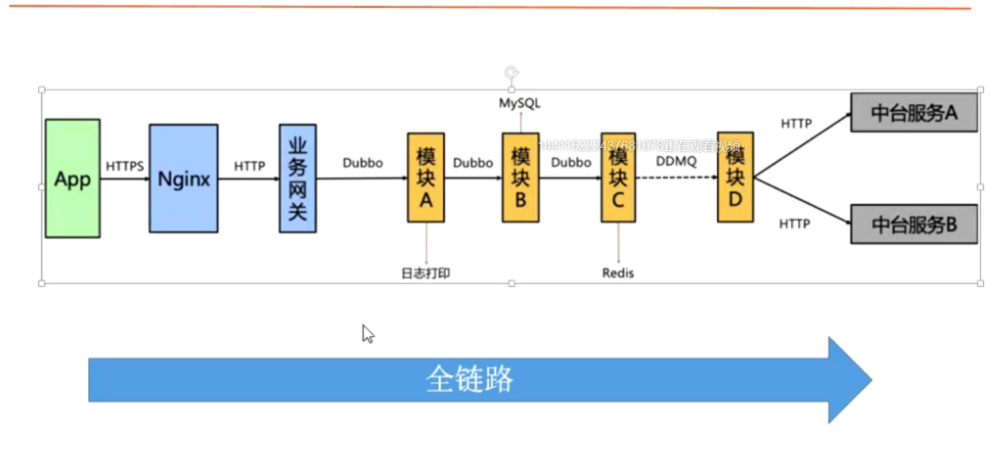 

### 压测工具（平台）选型

    * Jmeter Grinder、Tsung、Gatling 自实现引擎+操控中心
    
### 集群部署与负载均衡（Load balance）

    * 负载均衡意思是将负载（工作任务、访问请求）进行平衡，分摊到多个操作单元（服务器、组件）上进行执行
      是解决高性能、单点故障（高可用），扩展性（水平伸缩）的终极解决方案
      
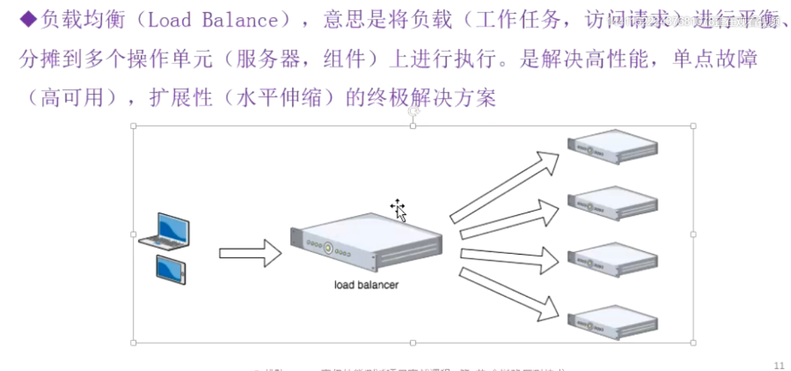 

### 负载均衡工具

    不做具体业务逻辑，就是分发任务，比如食堂有多个窗口打饭，学生打饭需要检验饭票，为了节省时间，安排一个人
    在窗口前进行检查饭票，然后指定人去哪个窗口直接打饭即可，如果有窗口关闭了就会指定到其它窗口分担工作

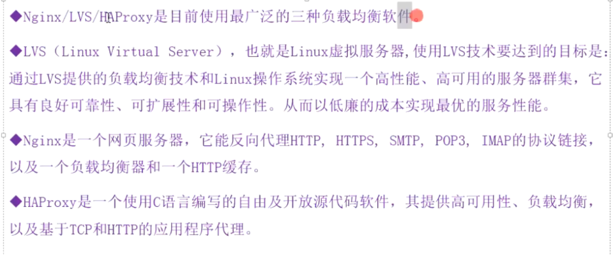 

### 性能测试常见的坑

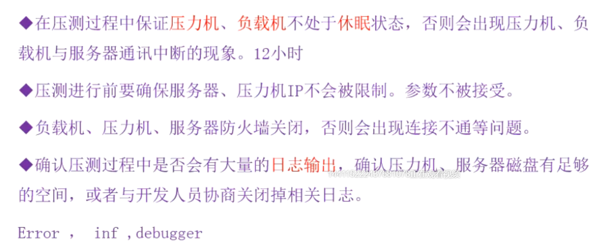 

    * 第一点尤其是有些界面是不可以休眠的，否则会导致中断
    * 第二点要跟运维说明哪些ip在做测试，被发现大量请求会被认为在攻击
    * 与开发协商先调高日志打印级别为error的，防止打印大量日志内容
    
### 性能案例剖析——拓扑结构

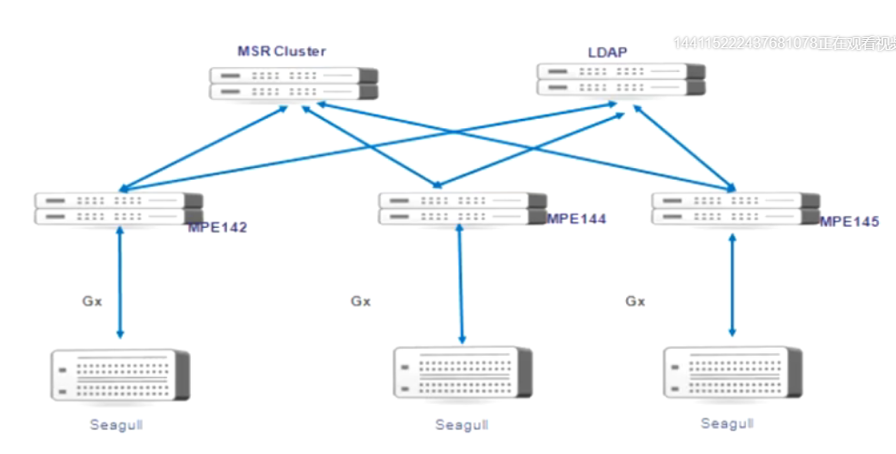 
    
    * Seagull是发消息的，例如http消息（可以认为是Jmeter）
    * 上面的Seagull发消息到LB（负载均衡器），然后将业务分发给MPE142/MPE144/MPE145
    * 最后查看数据到MSR Cluster（用户信息数据）库和LDAP（路由数据）库里
    
    LB故障则会出现所有服务宕机情况，这个负载均衡器会成为瓶颈，所以会存在一个主LB（active）
    和一个备LB（Standby），主备数据是一致，这两个主备都为同一个环境称为SiteA
    在另外的城市还存在另一个数据一致的同一个环境称为SiteB，通讯项目要求较高

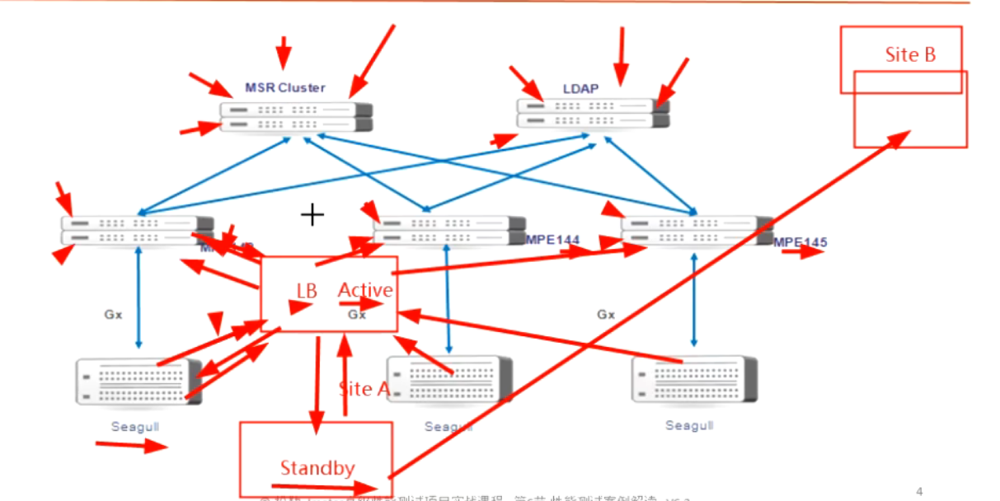    

    LDAP存在两台数据库，一台是主的，一台是备的做到读写分离
    数据库的读是从备里读的，写（写慢一点）是写到主数据库中的，可能存在备数据库同步更新数据不及时，会监控你的数据在主数据有没有被改写
    改写后再去查询就会等待下，从主数据同步过来后再查询出来
    
### 排查性能问题的参考方法

    性能问题排查步骤：
        1、负载机的问题
            * 发包、发压力的机器Jmeter，别搞的自己的性能占用都100%
            * 有时候发现Jmeter好多错误丫，其实是Jmeter自己的错误
            * 不要理想化说用一台PC机器压垮服务器，看到Jemeter报错就以为是成功了，其实是自己负载的问题，一看服务器传过去压力很小，自己先倒了
            
        2、网络的问题
            * 防火墙，很多时候Jemeter发不出去消息，可能是防火墙拒绝了
            
        3、硬件的问题
            * 硬件配置很低
            
        4、数据库的问题
            * 访问量、并发量很高的时候会发现很慢，特别是消耗数据库类型的
            * 比如说表连接、索引用多了，复杂查询就很慢，通过把慢查询语句抠出来分析这条语句慢的原因，是不是连了多张表
            
        5、中间件的问题
            * Java项目用了第三方控件，垃圾回收有硬伤导致整个系统性能下降，测试因为新版本引入控件的原因
            
        6、jvm
        7、缓存服务器
        8、业务程序的逻辑等问题
        
### 典型性能问题及原因
    
    1、在所有负载水平下（不管跑什么项目都很慢）响应缓慢：在某些情况下，无论负载如何，响应都是不可接受的
       这可能是由底层性能引起的，可能原因有：糟糕的数据库设计或实施；网络延迟和其他后台负载，这些问题
       可以在功能性和可用性中发现而不仅仅是性能测试
       
    2、在中高负载下响应缓慢：在某些情况下，响应会随着中到重度负载而降低，即使这些负载完全在正常、预期和允许的范围内
       这是不可接受的，潜在缺陷包括一个或多个资源的饱和及后台负载变化
       
    3、随着时间的推移、响应降低、在某些情况下，随着时间的推移，响应会逐渐的或严重的下降
       根本原因包括内存泄露、磁盘碎片、随着时间增加的网络负载，文件存储库的增长集及意外的数据库增长
       
       JAVA一般不存在内存泄露问题，存在垃圾回收不及时或中断问题
       
    4、高负载或超过负载下出错处理不充分或粗暴：在某些情况下，响应时间可以接收的，但出错处理在高负载和超出极限负载
      水平下会降低，潜在缺陷包括资源池不足，队列或堆栈太小以及超时设置太快
      
### 性能架构师成长道路

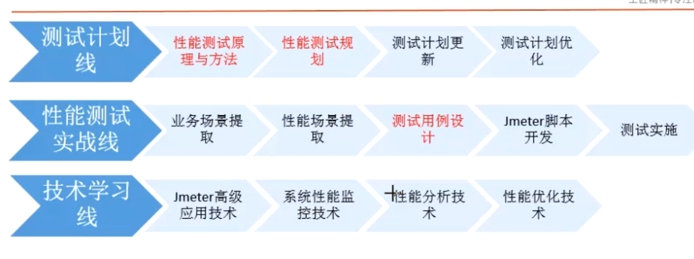          