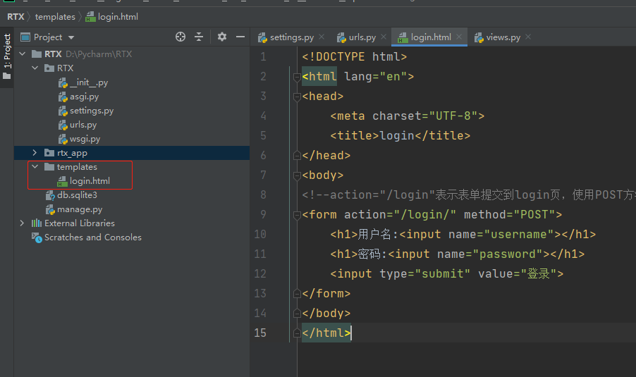
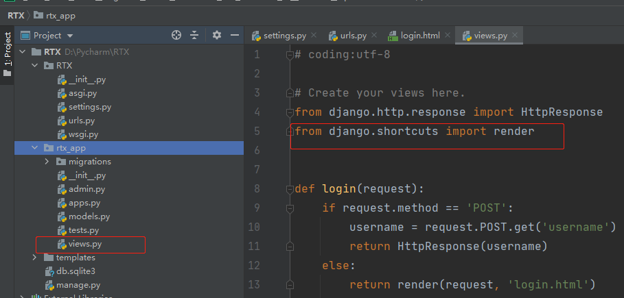
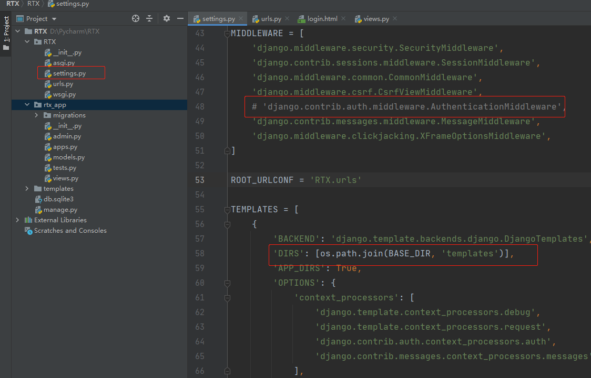
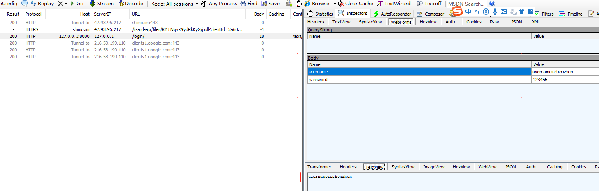
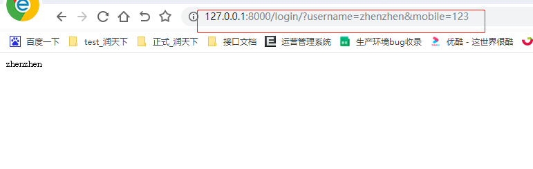
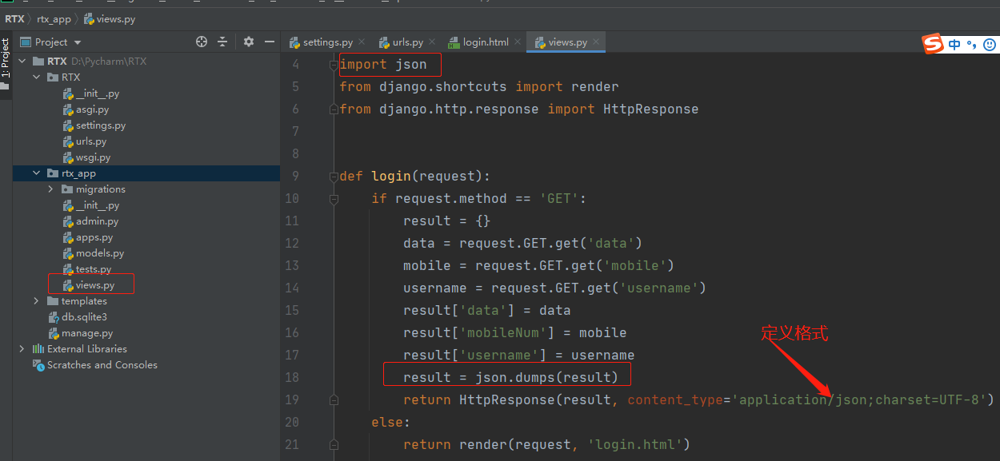
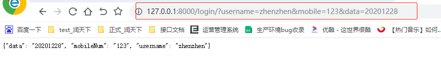
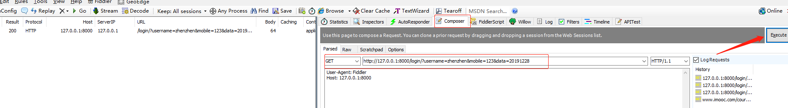

## Django的post接口简单开发

    1、 新建templates文件夹，文件中创建login.html定义表单内容为输入用户名、密码使用POST请求提交
    
```html
<!DOCTYPE html>
<html lang="en">
<head>
    <meta charset="UTF-8">
    <title>login</title>
</head>
<body>
<!--action="/login"表示表单提交到login页，使用POST方法-->
<form action="/login/" method="POST">
    <h1>用户名:<input name="username"></h1>
    <h1>密码:<input name="password"></h1>
    <input type="submit" value="登录">
</form>
</body>
</html>
```



    2. views.py视图文件定义函数接收请求进行判断，然后返回数据
    注意：导入from django.shortcuts import render包
    
```python
# coding:utf-8

# Create your views here.
from django.http.response import HttpResponse
from django.shortcuts import render


def login(request):
    if request.method == 'POST':
        username = request.POST.get('username')
        return HttpResponse(username)
    else:
        return render(request, 'login.html')
```
 
  

    3. 防止报错：TemplateDoesNotExist at /login/需要在settings.py文件中的TEMPLATES列表中指定请求的地址
    4. 防止报错: Forbidden(403)安全验证不通过
    
 
```python
TEMPLATES = [
    {
        'BACKEND': 'django.template.backends.django.DjangoTemplates',
        'DIRS': [os.path.join(BASE_DIR, 'templates')],
        'APP_DIRS': True,
        'OPTIONS': {
            'context_processors': [
                'django.template.context_processors.debug',
                'django.template.context_processors.request',
                'django.contrib.auth.context_processors.auth',
                'django.contrib.messages.context_processors.messages',
            ],
        },
    },
]
```





    5. 可以通过fiddler抓包判断是否请求成功
    



## Django的get接口简单开发  

    1. 只需要将上面创建post请求中的views.py文件定义的函数中，请求方法修改为GET，其余的文件代码不变
    
```python
# coding:utf-8

# Create your views here.
from django.http.response import HttpResponse
from django.shortcuts import render


def login(request):
    if request.method == 'GET':
        mobile = request.GET.get('mobile')
        username = request.GET.get('username')
        return HttpResponse(username, mobile)
    else:
        return render(request, 'login.html')
```

    2. 浏览器访问地址：http://127.0.0.1:8000/login/?username=zhenzhen&mobile=123
    注意：这样访问只能返回一个参数的值，要想返回所有参数值则需要序列化
    
    


 
## Django接口返回数据处理

    1. get请求返回数据以json格式显示
        首先views.py文件中导入json包
        然后函数中定义多个参数，使用json.dumps()方法将字符串数据结构，转换成JSON
        
```python
import json
from django.shortcuts import render
from django.http.response import HttpResponse


def login(request):
    if request.method == 'GET':
        result = {}
        data = request.GET.get('data')
        mobile = request.GET.get('mobile')
        username = request.GET.get('username')
        result['data'] = data
        result['mobileNum'] = mobile
        result['username'] = username
        result = json.dumps(result)
        return HttpResponse(result, content_type='application/json;charset=UTF-8')
    else:
        return render(request, 'login.html')
```




    2. 浏览器以get请求方法拼接参数访问：http://127.0.0.1:8000/login/?username=zhenzhen&mobile=123&data=20191228
    


    3. fiddler判断返回数据格式
        Composer——选择get请求——输入请求——点击Execute——查看返回数据
    
   

    4.POST请求同理，只需要将views.py视图中定义函数的请求方法改为'POST'即可
    
```python
# Create your views here.
import json
from django.shortcuts import render
from django.http.response import HttpResponse


def login(request):
    if request.method == 'POST':
        result = {}
        username = request.POST.get('username')
        password = request.POST.get('password')
        result['username'] = username
        result['password'] = password
        result = json.dumps(result)
        return HttpResponse(result, content_type='application/json;charset=UTF-8')
    else:
        return render(request, 'login.html')

``` 

